# Documentação de Componentes

> Diagramas de fluxo por componente. Para descrições textuais de cada arquivo, ver [00_inventory.md](00_inventory.md).
## scripts/main.py

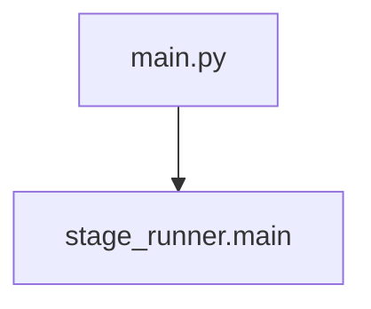

## scripts/pipeline/stage_runner.py

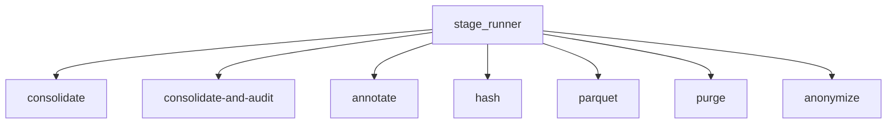

## scripts/pipeline_utils.py

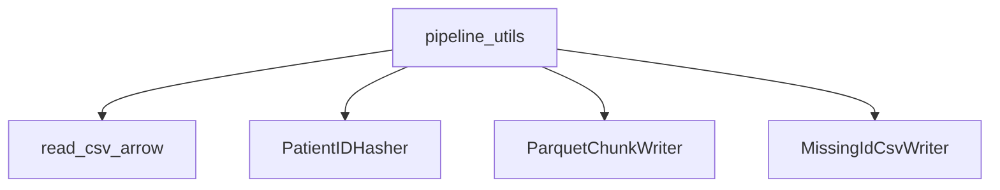

## scripts/pipeline/raw_to_consolidated/patient_preparation.py

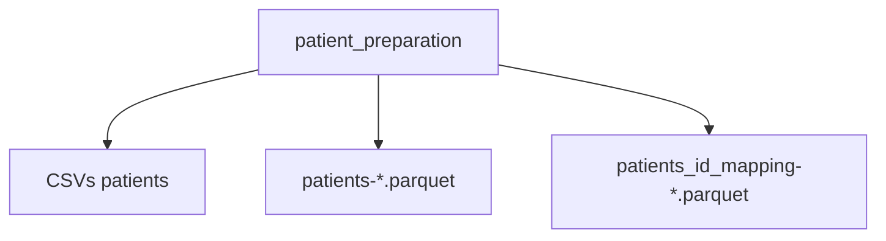

## scripts/pipeline/raw_to_consolidated/waveform_consolidation.py

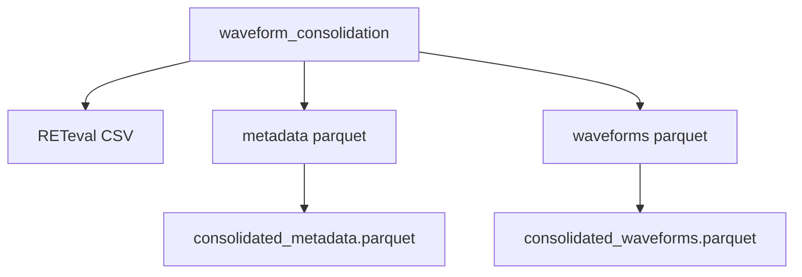

## scripts/pipeline/raw_to_consolidated/consolidate_from_raw.py

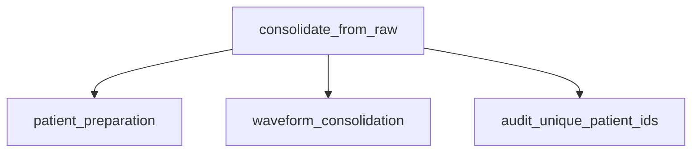

## scripts/pipeline/hashing/normalize_patients.py

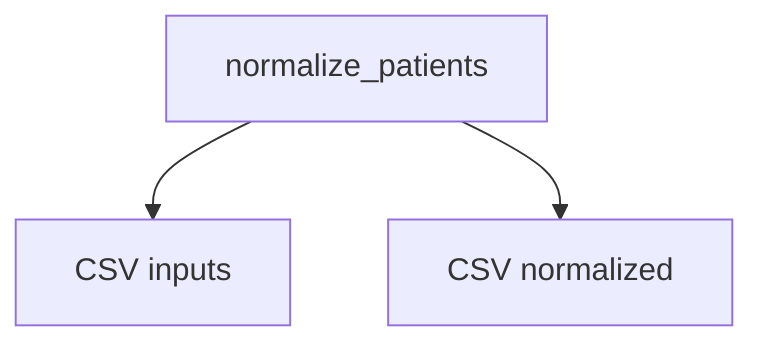

## scripts/pipeline/hashing/hash_mapping.py

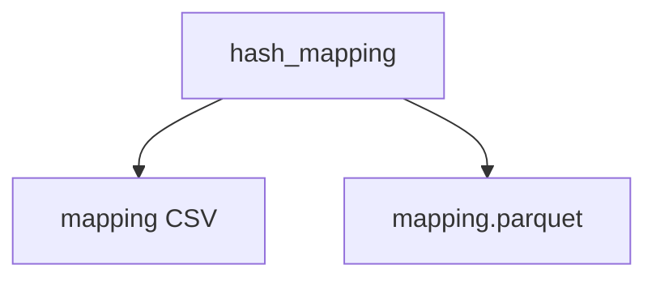

## scripts/pipeline/hashing/hash_apply_streaming.py

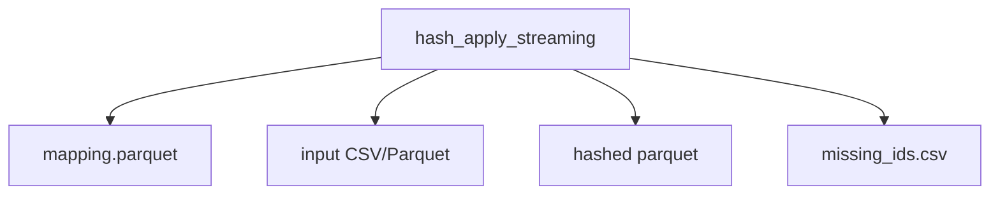

## scripts/pipeline/hashing/hash_orchestrator.py

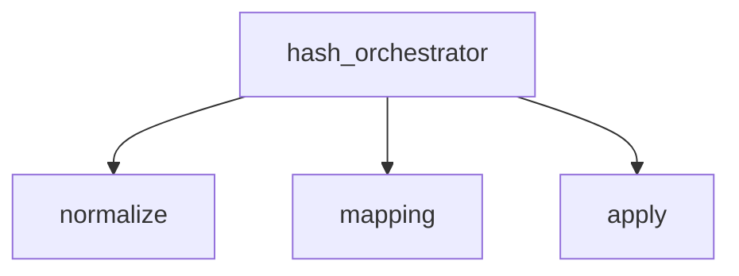

## scripts/pipeline/consolidated_to_parquet/parquet_generation.py

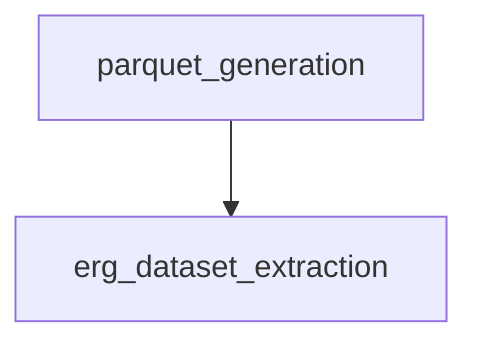

## scripts/pipeline/anonymize/anonymize_from_output.py

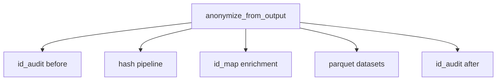

## scripts/pipeline/purge/purge_orphan_ids.py

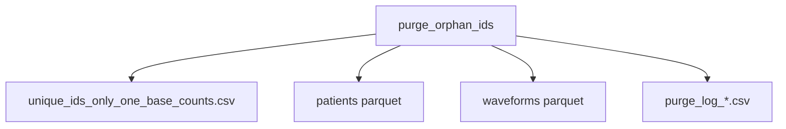

## scripts/processing/erg_dataset_extraction.py

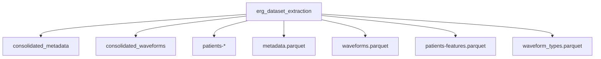

## scripts/processing/erg_spectral_extraction.py

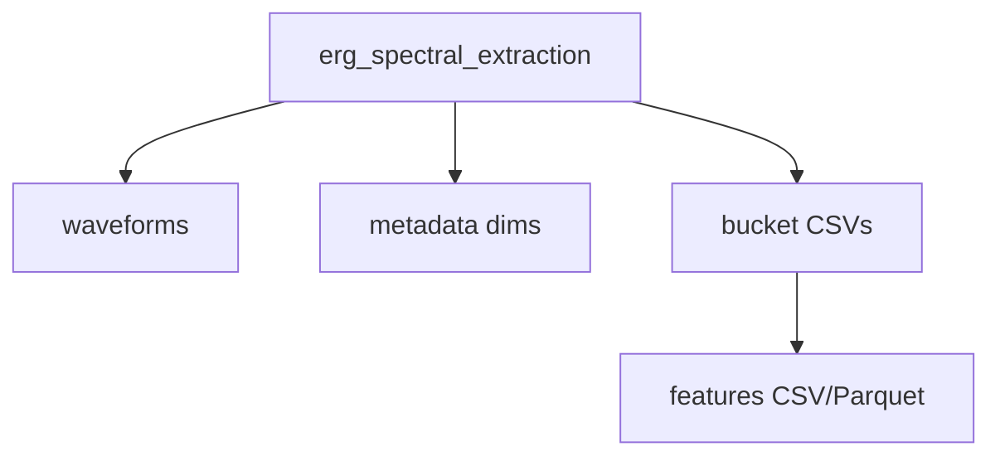

## scripts/processing/annotate_patient_mapping.py

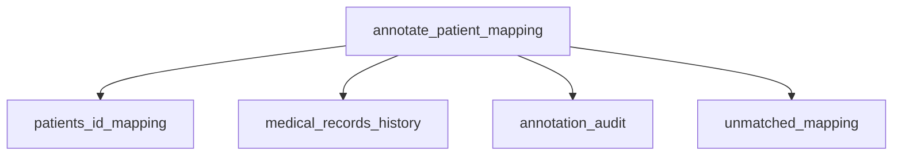

## scripts/processing/add_gender_to_patients.py

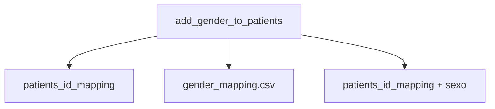

## scripts/analysis/audit_unique_patient_ids.py

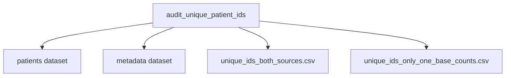

## scripts/analysis/audit_records_coverage.py

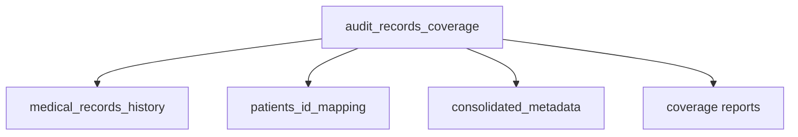

## scripts/analysis/records_split.py

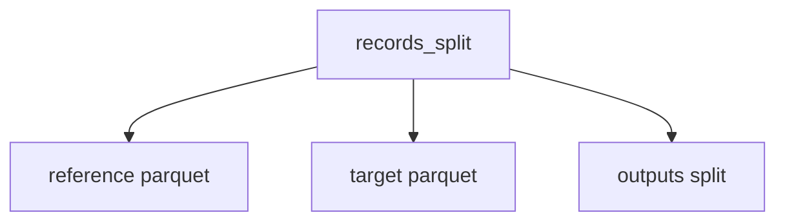

## scripts/analysis/dbscan_density.py

```mermaid
flowchart TD
    A[dbscan_density] --> B[erg_spectral_features.csv]
    A --> C[cluster outputs]
    A --> D[pca PNG]
```

## scripts/analysis/dbscan_sweep.py

```mermaid
flowchart TD
    A[dbscan_sweep] --> B[erg_spectral_features.csv]
    A --> C[dbscan_sweep_by_waveform.csv]
    A --> D[dbscan_sweep_global.csv]
```

## scripts/analysis/classification/data_prep.py

```mermaid
flowchart TD
    A[data_prep] --> B[features + labels]
    A --> C[train/test split]
```

## scripts/analysis/classification/pipeline.py

```mermaid
flowchart TD
    A[classification pipeline] --> B[preprocess]
    A --> C[model]
    A --> D[nested CV]
```

## scripts/analysis/classification/evaluation.py

```mermaid
flowchart TD
    A[evaluation] --> B[metrics]
    A --> C[confusion matrix]
```

## scripts/analysis/classification/feature_importance.py

```mermaid
flowchart TD
    A[feature_importance] --> B[importances DF]
```

## scripts/analysis/classification/persistence.py

```mermaid
flowchart TD
    A[persistence] --> B[training/test parquet]
    A --> C[model.joblib]
    A --> D[predictions parquet]
```

## scripts/questionnaire/record_linkage.py

```mermaid
flowchart TD
    A[record_linkage] --> B[questionnaire JSON]
    A --> C[patients_id_mapping]
    A --> D[right_eye]
    A --> E[linkage outputs]
```

## scripts/visualization/parquet_preview.py

```mermaid
flowchart TD
    A[parquet_preview] --> B[parquet datasets]
    A --> C[preview CSV]
```

## scripts/visualization/waveform_sample_plot.py

```mermaid
flowchart TD
    A[waveform_sample_plot] --> B[waveforms input]
    A --> C[PNG outputs]
```

## scripts/common/path_utils.py

```mermaid
flowchart TD
    A[path_utils] --> B[resolve_input_path]
    A --> C[resolve_output_dir]
```

## scripts/common/logging_utils.py

```mermaid
flowchart TD
    A[logging_utils] --> B[logs/pipeline_*.log]
```

## scripts/common/id_utils.py

```mermaid
flowchart TD
    A[id_utils] --> B[normalize_name]
    A --> C[build_patient_unique_id]
```

## scripts/common/name_utils.py

```mermaid
flowchart TD
    A[name_utils] --> B[variations]
```

## scripts/common/date_utils.py

```mermaid
flowchart TD
    A[date_utils] --> B[birth_year_range_expr]
```

## scripts/common/patient_lookup.py

```mermaid
flowchart TD
    A[patient_lookup] --> B[patient_table]
    A --> C[righteye_table]
```

## scripts/common/patient_utils.py

```mermaid
flowchart TD
    A[patient_utils] --> B[dob_year expr]
```

## scripts/common/value_utils.py

```mermaid
flowchart TD
    A[value_utils] --> B[bool/None]
```

## scripts/common/df_utils.py

```mermaid
flowchart TD
    A[df_utils] --> B[deduped DF]
```
