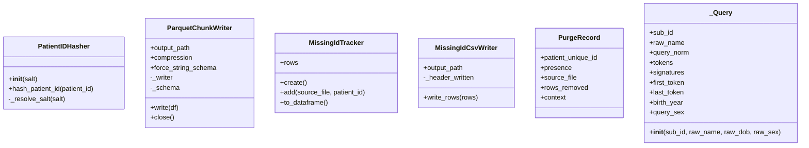

# Documentação de Classes

## PatientIDHasher
Arquivo: scripts/pipeline_utils.py (linha 69)

Responsabilidade:
- Gerar hash bcrypt de patient_unique_id com salt opcional (arg ou .env).

Atributos:
- salt: bytes (salt bcrypt resolvido)
- _ROUNDS: int (12)
- _BCRYPT_PREFIX: str ("$2a$")

Métodos:
- __init__(salt: Optional[str])
- _resolve_salt(salt: Optional[str]) -> bytes
- hash_patient_id(patient_id: str) -> str

Dependências:
- bcrypt, dotenv (.env), os

Instâncias criadas:
- Criada em hash_mapping.run

Classes utilizadas:
- N/A

Classes consumidoras:
- N/A (uso funcional)

## ParquetChunkWriter
Arquivo: scripts/pipeline_utils.py (linha 104)

Responsabilidade:
- Escrever parquet incremental por chunks, preservando schema.

Atributos:
- output_path: Path
- compression: str (default "snappy")
- force_string_schema: bool
- _writer: Optional[pq.ParquetWriter]
- _schema: Optional[pa.Schema]

Métodos:
- __post_init__()
- write(df)
- close()

Dependências:
- pyarrow.parquet

Instâncias criadas:
- hash_apply_streaming._apply_single_input

Classes utilizadas:
- pyarrow.parquet.ParquetWriter

Classes consumidoras:
- N/A

## MissingIdTracker
Arquivo: scripts/pipeline_utils.py (linha 152)

Responsabilidade:
- Acumular IDs sem hash para debug em memória.

Atributos:
- rows: List[Dict[str, str]]

Métodos:
- create() -> MissingIdTracker
- add(source_file: str, patient_id: str)
- to_dataframe() -> pl.DataFrame

Dependências:
- polars

Instâncias criadas:
- N/A (não usado diretamente nos scripts observados)

Classes utilizadas:
- N/A

Classes consumidoras:
- COMPORTAMENTO NÃO CONFIRMADO (nao referenciado diretamente)

## MissingIdCsvWriter
Arquivo: scripts/pipeline_utils.py (linha 169)

Responsabilidade:
- Escrever CSV incremental com IDs sem hash.

Atributos:
- output_path: Path
- _header_written: bool

Métodos:
- write_rows(rows: List[Dict[str, str]])

Dependências:
- csv

Instâncias criadas:
- hash_apply_streaming.run

Classes utilizadas:
- N/A

Classes consumidoras:
- N/A

## PurgeRecord
Arquivo: scripts/pipeline/purge/purge_orphan_ids.py (linha 69)

Responsabilidade:
- Estrutura de auditoria por ID removido.

Atributos:
- patient_unique_id: str
- presence: str
- source_file: str
- rows_removed: int
- context: dict

Métodos:
- N/A (NamedTuple)

Dependências:
- typing.NamedTuple

Instâncias criadas:
- _purge_pyarrow, _purge_spark

Classes utilizadas:
- N/A

Classes consumidoras:
- _write_purge_log

## _Query
Arquivo: scripts/questionnaire/record_linkage.py (linha 222)

Responsabilidade:
- Encapsular dados normalizados de uma submissão do questionário.

Atributos:
- sub_id
- raw_name
- query_norm
- tokens
- signatures
- first_token
- last_token
- birth_year
- query_sex

Métodos:
- __init__(sub_id, raw_name, raw_dob, raw_sex)

Dependências:
- common.id_utils.normalize_name
- common.name_utils.tokens_from_raw, build_name_signatures
- common.date_utils.extract_birth_year

Instâncias criadas:
- _process (record_linkage)

Classes utilizadas:
- N/A

Classes consumidoras:
- match_record, _log_review

---

