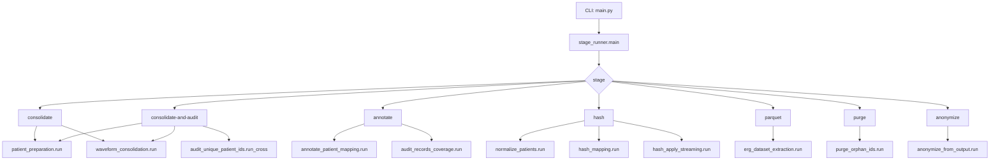

# Fluxo de Execução

## Visão Geral
- A execução principal inicia em scripts/main.py e delega para scripts/pipeline/stage_runner.py.
- O stage selecionado define a cadeia de chamadas e IO.

## Stage: consolidate
Responsabilidade:
- Gerar patients_id_mapping e consolidar waveforms/metadata.

Passos:
1) patient_preparation.run:
   - listar CSVs;
   - parsear linhas com heurística de header/encoding;
   - construir patient_unique_id;
   - gerar JSONL temporários;
   - criar SparkSession e escrever patients-*.parquet e patients_id_mapping-*.parquet.
2) waveform_consolidation.run:
   - ler CSVs RETeval;
   - extrair metadata e waveforms;
   - escrever parquets temporários por arquivo;
   - consolidar via Spark em consolidated_metadata.parquet e consolidated_waveforms.parquet;
   - reportar erros em processing_errors.txt.

## Stage: consolidate-and-audit
Responsabilidade:
- Consolidação completa + auditoria de IDs entre bases.

Passos:
1) Executar consolidação (patients + waveforms).
2) Localizar patients-*.parquet e consolidated_metadata.parquet.
3) audit_unique_patient_ids.run_cross:
   - gerar unique_ids_both_sources.csv e relatórios de divergência.

## Stage: annotate
Responsabilidade:
- Enriquecer patients_id_mapping e auditar cobertura vs prontuários.

Passos:
1) annotate_patient_mapping.run:
   - construir lookups por prontuário/nome;
   - aplicar match e enriquecer colunas clínicas;
   - gerar annotation_audit e unmatched_mapping.
2) audit_records_coverage.run:
   - cruzar medical_records_history vs mapping e metadata;
   - gerar relatórios de cobertura.

## Stage: hash
Responsabilidade:
- Normalizar IDs, gerar mapping hash e aplicar hash nos datasets.

Passos:
1) normalize_patients.run:
   - normalizar coluna patient_unique_id.
2) hash_mapping.run:
   - gerar mapping parquet patient_id -> hash (bcrypt).
3) hash_apply_streaming.run:
   - aplicar mapping em CSV/Parquet;
   - corrigir IDs via metadata (source_file+test_id);
   - remover colunas sensíveis e escrever parquets hash;
   - registrar missing_ids.csv.

## Stage: parquet
Responsabilidade:
- Gerar datasets finais (metadata, waveforms, features, waveform_types).

Passos:
1) erg_dataset_extraction.run:
   - limpar metadata;
   - extrair features de patients;
   - gerar waveform_types;
   - escrever parquets finais.

## Stage: purge
Responsabilidade:
- Remover IDs órfãos identificados no id_audit.

Passos:
1) Ler unique_ids_only_one_base_counts.csv.
2) Descobrir parquets alvo em output/patients e output/waveforms/consolidated.
3) Remover IDs com PyArrow ou Spark.
4) Gerar purge_log_*.csv.

## Stage: anonymize
Responsabilidade:
- Fluxo end-to-end de anonimizar output/ e gerar datasets finais.

Passos:
1) Descobrir datasets patients/metadata/waveforms em output/.
2) Executar audit_unique_patient_ids before.
3) Gerar mapping hash e aplicar em datasets.
4) Enriquecer id_map com anotações e corrigir sexo.
5) Executar erg_dataset_extraction em staging hash.
6) Executar audit_unique_patient_ids after.

## Fluxos auxiliares (fora do stage_runner)
- questionnaire/record_linkage.py: linkage entre questionário, mapping e RightEye.
- processing/erg_spectral_extraction.py: extração espectral a partir de waveforms.
- visualization/parquet_preview.py e waveform_sample_plot.py: previews e plots.
