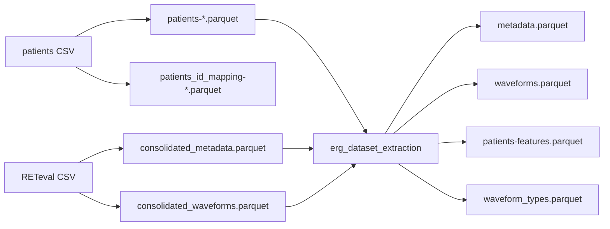
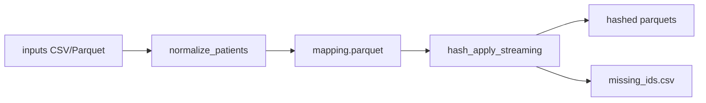
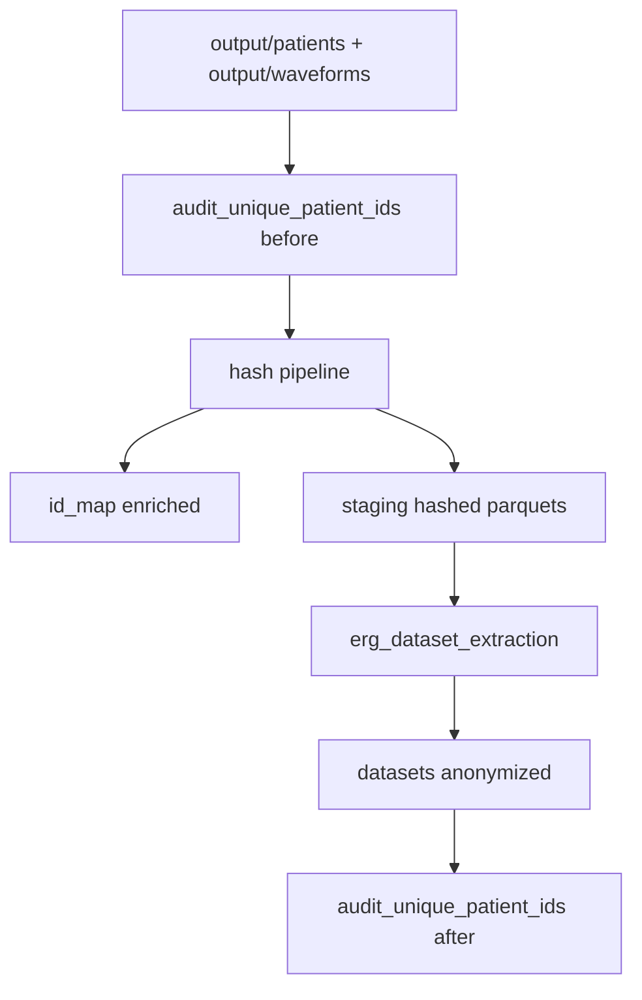
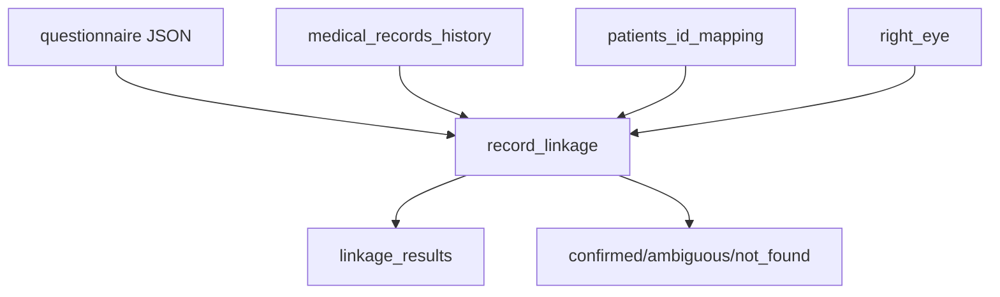

# Fluxo de Dados

## Fontes Primárias
- patients CSV: dados de pacientes (prontuario, nome, birth, test date).
- waveforms CSV (RETeval): metadata + series temporais.
- medical_records_history.parquet: historico clinico.
- questionnaire JSON: respostas do questionario.
- RightEye parquet: base externa para linkage.

## Fluxo principal (raw -> consolidated -> datasets)

## Fluxo de hashing

## Fluxo de anonimizar output/

## Fluxo de linkage (questionnaire)

## Entidades e chaves principais
- patient_unique_id:
  - origem: patient_preparation (CSV patients) e waveform_consolidation (filename/metadata)
  - uso: join entre patients, metadata e waveforms
- test_id:
  - origem: waveform_consolidation (contagem por test_no)
  - uso: distinguir exames no mesmo paciente
- waveform_type:
  - origem: metadata do RETeval
  - uso: derivar waveform_type_id e features
- waveform_type_id:
  - origem: erg_dataset_extraction (mapeamento)
  - uso: features espectrais e agrupamentos

## Transformações principais
1) Normalização de IDs
- ID bruto -> patient_unique_id canonical
- patient_unique_id -> hashed (bcrypt)

2) Consolidação de waveforms
- CSV RETeval -> metadata parquet
- CSV RETeval -> waveforms parquet (time_ms, signal, test_id)

3) Datasets finais
- metadata: limpa colunas sensiveis
- waveforms: agrega waveform_type_id
- features: extrai colunas com prefixo feature_ (patients)
- waveform_types: dicionario de tipos

## Relatórios e auditorias
- unique_ids_both_sources.csv: IDs comuns entre patients e metadata.
- unique_ids_only_one_base_counts.csv: IDs presentes em apenas uma base (para purge).
- annotation_audit_*.parquet: revisao de enrichment clinico.
- records_*.parquet/csv: cobertura de prontuarios.
- processing_errors.txt: CSVs RETeval com erro.
