# Dependências

## Dependências externas (principais)
- pandas: leitura/transformação de CSV/Parquet, auditorias e ML.
- polars: transformacoes e joins em alta performance.
- pyarrow: leitura/escrita Parquet, CSV Arrow.
- pyspark: consolidacao de parquets em larga escala.
- sklearn: ML (pipelines, DBSCAN, metrics).
- matplotlib: plots (PCA, confusion matrix, waveforms).
- rapidfuzz: fuzzy matching de nomes (record linkage).
- bcrypt: hash irreversivel de patient_unique_id. (requer: pip install bcrypt)
- chardet: deteccao de encoding.
- dotenv: carregar salt do .env. (requer: pip install python-dotenv)
- pywt, scipy: features espectrais e wavelet.
- imblearn: SMOTE para balanceamento de classes. (requer: pip install imbalanced-learn)
- joblib: serializacao de modelos sklearn. (requer: pip install joblib)

> Atencao: bcrypt, python-dotenv, imbalanced-learn e joblib nao estao listados em requirements.txt.
> Instale manualmente se for usar anonymize (bcrypt/dotenv) ou classificacao (imblearn/joblib).

## Dependências internas (alto nivel)

```mermaid
flowchart TD
    A[main.py] --> B[stage_runner]

    B --> C[raw_to_consolidated]
    B --> D[hashing]
    B --> E[consolidated_to_parquet]
    B --> F[purge]
    B --> G[anonymize]
    B --> H[processing]
    B --> I[analysis]

    C --> C1[patient_preparation]
    C --> C2[waveform_consolidation]
    C --> C3[consolidate_from_raw]

    D --> D1[normalize_patients]
    D --> D2[hash_mapping]
    D --> D3[hash_apply_streaming]

    E --> E1[erg_dataset_extraction]

    F --> F1[purge_orphan_ids]

    G --> G1[anonymize_from_output]

    H --> H1[annotate_patient_mapping]
    H --> H2[erg_spectral_extraction]

    I --> I1[audit_unique_patient_ids]
    I --> I2[audit_records_coverage]
    I --> I3[records_split]
    I --> I4[dbscan_density]
    I --> I5[dbscan_sweep]
    I --> I6[classification/*]

    Q[questionnaire] --> Q1[record_linkage]
    V[visualization] --> V1[parquet_preview]
    V --> V2[waveform_sample_plot]

    U[pipeline_utils] --> D1
    U --> D2
    U --> D3
    U --> G1
    U --> E1
    U --> I1
    U --> H1

    C1 --> Z[common/*]
    C2 --> Z
    D1 --> Z
    D2 --> Z
    D3 --> Z
    E1 --> Z
    F1 --> Z
    G1 --> Z
    H1 --> Z
    I1 --> Z
    Q1 --> Z
```

## Módulos comuns reutilizados
- common.id_utils: normalização de IDs e nomes.
- common.path_utils: resolução de paths.
- common.logging_utils: logging padrao.
- common.name_utils/date_utils/patient_lookup: linkage e normalização.
- common.value_utils/df_utils: normalizacao de valores e dedup.

## Dependências criticas por area
- Consolidacao: pyspark + pyarrow
- Hashing: bcrypt + polars + pyarrow
- Datasets finais: pandas + pyarrow
- Espectral: numpy + scipy + pywt
- Linkage: rapidfuzz + polars
- ML: sklearn + imblearn (opcional)
