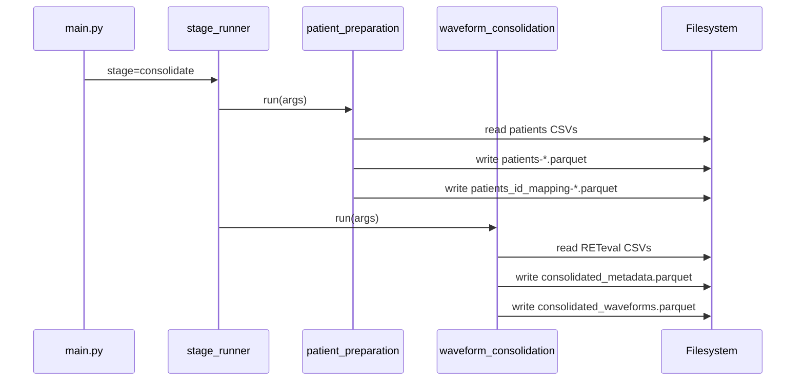
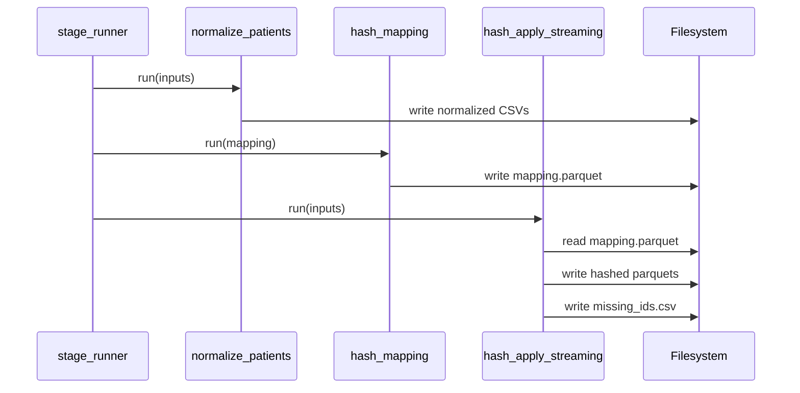
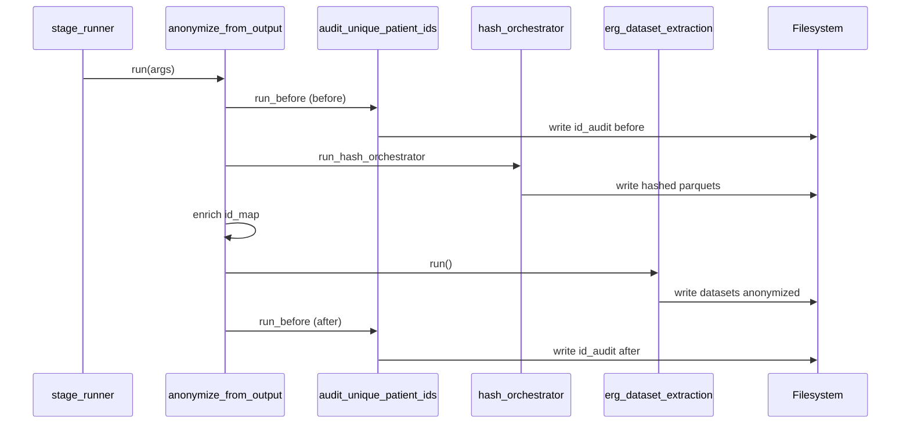
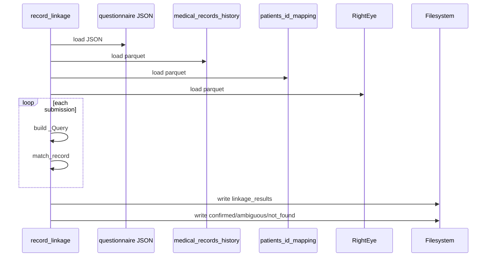
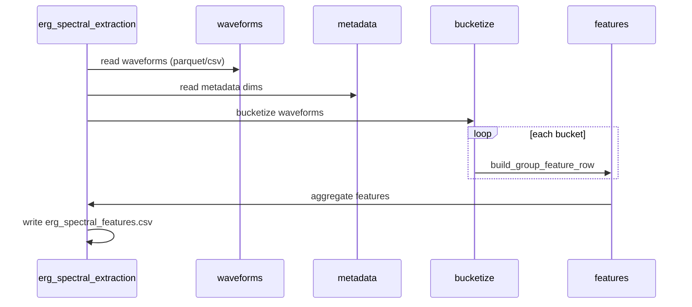

# Diagramas de Sequência

## Consolidate (patients + waveforms)

```mermaid
sequenceDiagram
    participant CLI as main.py
    participant SR as stage_runner
    participant PP as patient_preparation
    participant WC as waveform_consolidation
    participant FS as Filesystem

    CLI->>SR: stage=consolidate
    SR->>PP: run(args)
    PP->>FS: read patients CSVs
    PP->>FS: write patients-*.parquet
    PP->>FS: write patients_id_mapping-*.parquet
    SR->>WC: run(args)
    WC->>FS: read RETeval CSVs
    WC->>FS: write consolidated_metadata.parquet
    WC->>FS: write consolidated_waveforms.parquet
```

## Hash apply

```mermaid
sequenceDiagram
    participant CLI as stage_runner
    participant NM as normalize_patients
    participant HM as hash_mapping
    participant HA as hash_apply_streaming
    participant FS as Filesystem

    CLI->>NM: run(inputs)
    NM->>FS: write normalized CSVs
    CLI->>HM: run(mapping)
    HM->>FS: write mapping.parquet
    CLI->>HA: run(inputs)
    HA->>FS: read mapping.parquet
    HA->>FS: write hashed parquets
    HA->>FS: write missing_ids.csv
```

## Anonymize

```mermaid
sequenceDiagram
    participant CLI as stage_runner
    participant AN as anonymize_from_output
    participant AU as audit_unique_patient_ids
    participant HA as hash_orchestrator
    participant EX as erg_dataset_extraction
    participant FS as Filesystem

    CLI->>AN: run(args)
    AN->>AU: run_before (before)
    AU->>FS: write id_audit before
    AN->>HA: run_hash_orchestrator
    HA->>FS: write hashed parquets
    AN->>AN: enrich id_map
    AN->>EX: run()
    EX->>FS: write datasets anonymized
    AN->>AU: run_before (after)
    AU->>FS: write id_audit after
```

## Record linkage

```mermaid
sequenceDiagram
    participant RL as record_linkage
    participant Q as questionnaire JSON
    participant MR as medical_records_history
    participant MAP as patients_id_mapping
    participant RE as RightEye
    participant FS as Filesystem

    RL->>Q: load JSON
    RL->>MR: load parquet
    RL->>MAP: load parquet
    RL->>RE: load parquet
    loop each submission
        RL->>RL: build _Query
        RL->>RL: match_record
    end
    RL->>FS: write linkage_results
    RL->>FS: write confirmed/ambiguous/not_found
```

## Spectral extraction

```mermaid
sequenceDiagram
    participant CLI as erg_spectral_extraction
    participant WF as waveforms
    participant MD as metadata
    participant BK as bucketize
    participant FE as features

    CLI->>WF: read waveforms (parquet/csv)
    CLI->>MD: read metadata dims
    CLI->>BK: bucketize waveforms
    loop each bucket
        BK->>FE: build_group_feature_row
    end
    FE->>CLI: aggregate features
    CLI->>CLI: write erg_spectral_features.csv
```
