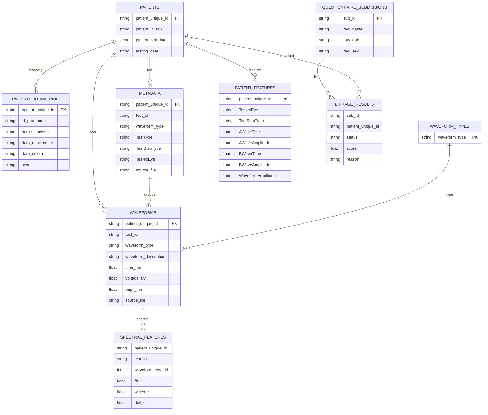

# Entidades (ERD)

## Observações
- patient_unique_id é a chave de integração entre patients, metadata e waveforms.
- test_id identifica exames dentro do mesmo paciente.
- voltage_uV e pupil_mm sao mutuamente exclusivos por waveform_type (eletrico vs pupilometria).
- SPECTRAL_FEATURES é derivado de WAVEFORMS + METADATA dims.
- LINKAGE_RESULTS relaciona questionário com pacientes ou registra falhas.
