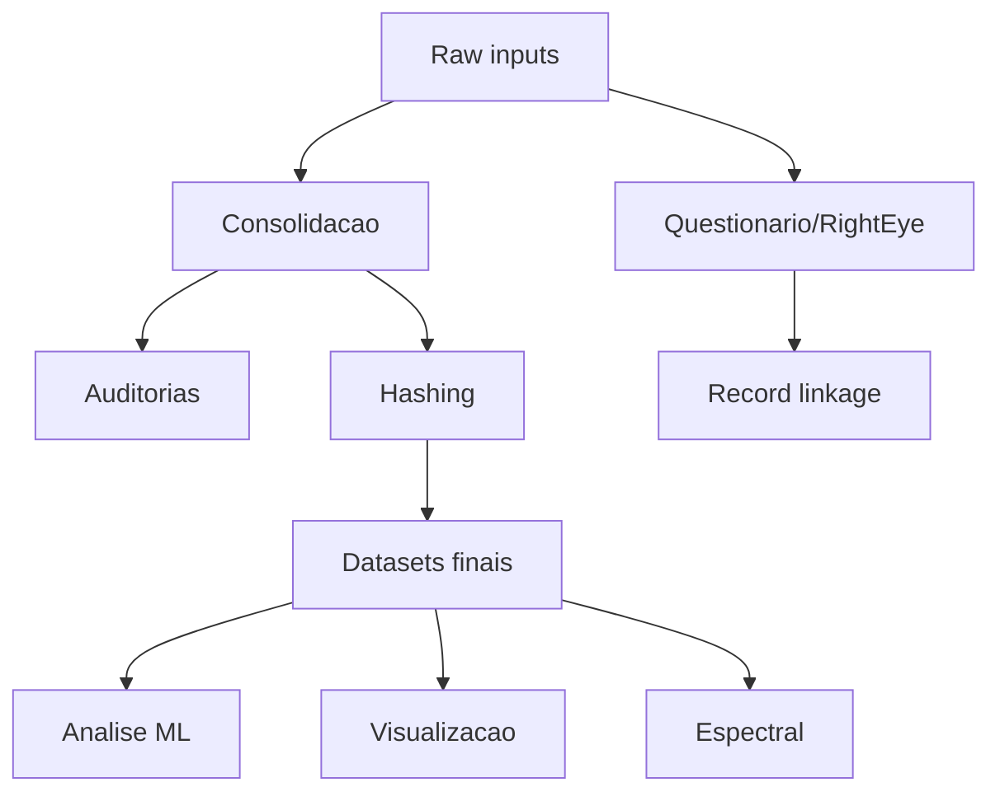
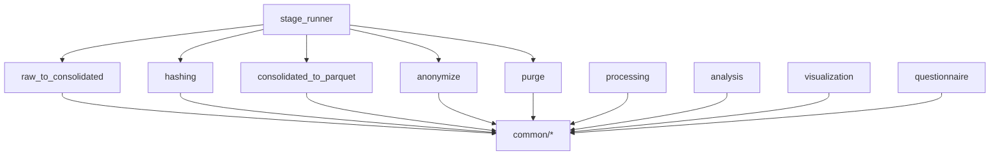

# Arquitetura

## Nível Alto
- Entrada: CSVs patients e RETeval + medical_records + questionnaire + RightEye.
- Pipeline: consolidação -> auditoria -> hashing -> datasets -> análise/visualização.
- Saídas: parquets finais, relatórios de auditoria, features espectrais, ML outputs.

## Nível Médio (componentes)
- Pipeline CLI: stage_runner + submodules (raw_to_consolidated, hashing, anonymize, purge, consolidated_to_parquet).
- Processing: annotate_patient_mapping, erg_dataset_extraction, erg_spectral_extraction.
- Analysis: audits, clustering, classification.
- Common: normalizacao de nomes/IDs, paths, logging.

## Nível Baixo (detalhe)
- Consolidação patients:
  - parse CSV + gerar patient_unique_id + spark write.
- Consolidação waveforms:
  - extracao metadata + waveforms + parquet + spark consolidate.
- Hash:
  - mapping bcrypt + aplicacao streaming (com correcoes de ID).
- Datasets finais:
  - limpar metadata, waveforms com waveform_type_id, extrair features.
- Espectral:
  - bucketização -> FFT/Welch/Wavelet.
- Linkage:
  - blocking por nome/ano/sexo + fuzzy matching.

## Padrões e limites
- Modularidade por pastas (pipeline, processing, analysis, visualization, questionnaire).
- Dependências centrais em common/* e pipeline_utils.
- IO pesado em parquets; Spark usado apenas onde volume pode ser grande.
