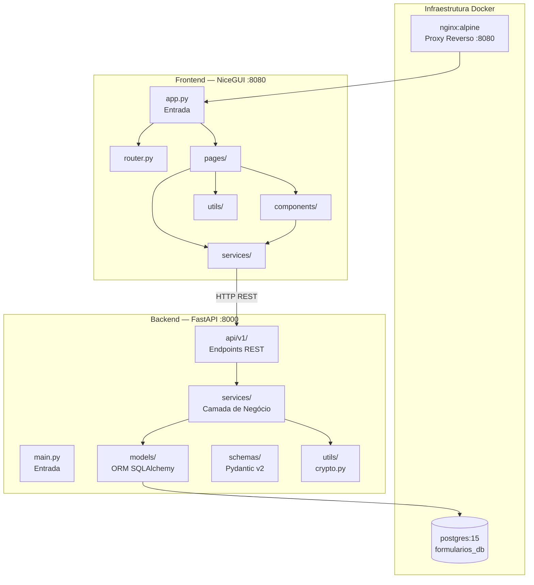

# 01 — Componentes e Módulos

## Visão Geral dos Módulos

---

## Backend: Módulos Detalhados

### Módulo: `app/main.py`

**Responsabilidade:** Bootstrap da aplicação FastAPI. Cria o banco de dados via `Base.metadata.create_all`, configura CORS permissivo (`allow_origins=["*"]`) e inclui o roteador principal em `/api/v1`.

**Inputs:** Nenhum (ponto de entrada ASGI)
**Outputs:** Aplicação FastAPI com endpoints `/`, `/health`, `/api/v1/*`
**Dependências:** `api.py`, `database.py`, `models/__init__.py`

---

### Módulo: `app/database.py`

**Responsabilidade:** Configura a conexão com o banco PostgreSQL via SQLAlchemy. Expõe `engine`, `SessionLocal` e `Base`. A função `get_db()` é um gerador FastAPI Dependency que garante fechamento da sessão.

**Inputs:** `settings.database_url`
**Outputs:** `engine`, `SessionLocal`, `Base`, `get_db()`
**Dependências:** `config.py`

---

### Módulo: `app/config.py`

**Responsabilidade:** Configuração via `pydantic-settings`. Detecta o IP público da máquina em runtime (tentando 3 endpoints externos) para definir `frontend_base_url`, usado na geração de links de questionários.

**Inputs:** variáveis de ambiente `.env`, chamadas HTTP externas (ipify, ifconfig, amazonaws)
**Outputs:** `settings` singleton com `database_url` e `frontend_base_url`
**Dependências:** `pydantic_settings`, `urllib.request`

---

### Módulo: `app/utils/crypto.py`

**Responsabilidade:** Encode/decode Base64 URL-safe para IDs de questionários. Permite que os links públicos não exponham IDs numéricos diretamente. Suporta IDs com ou sem padding.

**Inputs:** `int` (questionnaire_id) ou `str` (encoded_id)
**Outputs:** `str` codificado ou `int` decodado
**Dependências:** `base64`, `urllib.parse`

---

### Módulo: `app/services/user_service.py`

**Responsabilidade:** CRUD completo de usuários. Hashing de senhas com bcrypt via passlib. Login com verificação de hash.

**Inputs:** `Session` SQLAlchemy + schemas Pydantic
**Outputs:** ORM `User` ou `LoginResponse`
**Dependências:** `models/user.py`, `schemas/user.py`, passlib

---

### Módulo: `app/services/questionnaire_service.py`

**Responsabilidade:** CRUD de questionários e instruções. Geração de links com Base64. Carregamento de questionário para resposta (com suporte a ordenação custom/ascending/descending/random de itens e opções). Deleção em cascata manual (answers → submissions → options → questions → instructions → items → questionnaire).

**Inputs:** `Session`, schemas Pydantic, `str` encoded questionnaire ID
**Outputs:** `Questionnaire` ORM, `QuestionnaireForResponse`, `GenerateLinkResponse`
**Dependências:** Todos os models, `crypto.py`, `config.py`

---

### Módulo: `app/services/question_service.py`

**Responsabilidade:** CRUD de perguntas e opções. Valida unicidade de `caption`. Permite atualização de opções via deleção + recriação.

**Inputs:** `Session`, schemas ou dicts
**Outputs:** `Question` ORM
**Dependências:** `models/question.py`

---

### Módulo: `app/services/response_service.py`

**Responsabilidade:** Validação de submissões (verifica perguntas obrigatórias, tipos de resposta, opções válidas). Cálculo de scores (por opção correta/incorreta). Persistência de respostas. Preenche automaticamente "N/A" para campos `free_text` opcionais não respondidos.

**Inputs:** `Session`, `SubmissionCreate`
**Outputs:** `QuestionnaireSubmission` ORM, `SubmissionValidationResponse`
**Dependências:** `models/*`

---

### Módulo: `app/services/report_service.py`

**Responsabilidade:** Três operações principais: (1) `get_full_report` — relatório completo com stats por questão e submissões anônimas; (2) `get_summary_report` — resumo de total/média/max/min; (3) `custom_export` — exportação wide-format com filtros de data e seleção de colunas.

**Inputs:** `Session`, `questionnaire_id`, filtros opcionais
**Outputs:** `Dict` estruturado com dados de relatório
**Dependências:** Todos os models

---

### Módulo: `app/services/analytics_service.py`

**Responsabilidade:** Estatísticas descritivas (média, DP, mediana, moda, IIQ), scoring CHYPS-V (scores globais e por subescala), Alpha de Cronbach, correlação de Spearman, tabulação cruzada com qui-quadrado, filtragem demográfica, distribuição de questões (pie vs bar).

**Inputs:** Listas de dicts com dados de submissões e opções
**Outputs:** `Dict` com análises estatísticas
**Dependências:** `chyps_config.py`, numpy, scipy

---

### Módulo: `app/services/chyps_config.py`

**Responsabilidade:** Constantes de configuração do instrumento CHYPS-V: 20 itens (Q1-Q20), 4 subescalas (Brilho, Padrão, Estroboscópico, Ambiente Visual Intenso), Likert 0-3, filtros demográficos padrão.

**Inputs:** Nenhum (apenas constantes)
**Outputs:** `CHYPS_V_SUBSCALES`, `CHYPS_V_SCALE_ITEMS`, `DEMOGRAPHIC_FILTERS`, `LIKERT_TEXT_TO_SCORE`, `GLOBAL_SCORE_RANGE`

---

## Frontend: Módulos Detalhados

### Módulo: `frontend/app.py`

**Responsabilidade:** Define a rota raiz `/` e executa o servidor NiceGUI na porta 8080. Verifica se o usuário está autenticado (via `session_manager`) para decidir entre renderizar login ou dashboard. Configura `proxy_headers=True` para funcionar atrás do nginx.

**Inputs:** Storage NiceGUI por usuário
**Outputs:** Interface web
**Dependências:** `AuthPage`, `DashboardPage`, `session_manager`, `config`

---

### Módulo: `frontend/router.py`

**Responsabilidade:** Define a rota pública `/questionnaire/{questionnaire_id}/respond` que permite responder questionários sem autenticação. Também exporta `clear_and_render` para limpar e re-renderizar containers.

**Inputs:** `questionnaire_id: str` (Base64 na URL)
**Outputs:** Página de resposta
**Dependências:** `questionnaire_answer_page`

---

### Módulo: `frontend/services/api_client.py`

**Responsabilidade:** Wrapper sobre `requests.Session` com métodos GET/POST/PUT/DELETE. Faz parse de erros HTTP (extrai `detail`/`message`/`error_details` do JSON). Mapeia status 404 e 500+ para mensagens amigáveis ao usuário.

**Inputs:** endpoint strings, dicts de dados
**Outputs:** Dict / None
**Dependências:** `config.py`, requests

---

### Módulo: `frontend/utils/session_manager.py`

**Responsabilidade:** Armazena e recupera dados do usuário logado no `app.storage.user` do NiceGUI (storage por sessão/navegador). Métodos `login()`, `logout()`, propriedades `current_user` e `is_authenticated`.

**Inputs:** `nicegui.app.storage.user`
**Outputs:** Dict com dados do usuário ou None

---

### Módulo: `frontend/pages/questionnaire_create_page.py`

**Responsabilidade:** Editor de questionários. Gerencia um estado local (`state` dict) com lista de itens. Suporta criação e edição. Usa `SortableColumn` para drag-and-drop de itens e opções. Fluxo de save: sincroniza dados → cria/atualiza instruções e perguntas individualmente na API → cria/atualiza o questionário com os IDs resultantes.

**Inputs:** `on_done`, `on_cancel` callbacks, `questionnaire_id` opcional
**Outputs:** Questionário persistido via API

---

### Módulo: `frontend/pages/report_detailed.py`

**Responsabilidade:** Relatório analítico completo do CHYPS-V. Carrega `dashboard-data` em uma única chamada. Renderiza na ordem: Summary Cards → Question Cards → Crosstab → Score Histogram → Subscale Section → Reliability Card → Spearman Heatmap → Export Buttons. Suporta re-renderização dinâmica de seções analíticas quando filtros são aplicados.

**Inputs:** `questionnaire_id`, `container`, `on_back`
**Outputs:** Dashboard analítico completo

**Lógica de exibição de gráficos por questão:**
- Questões excluídas: TCLE, "Nome", "Email"
- Pie forçado: questão "indique o que queremos dizer", Raça/Etnia, Sexo
- Birthday: histograma por ano de nascimento
- Observation: tabela de texto com botão expandir
- 2 opções → pie; 3+ opções → bar

---

### Módulo: `frontend/components/questionnaire/question_item_editor.py`

**Responsabilidade:** Editor de um item do questionário. Suporta 3 tipos: `instruction` (textarea), `question` (caption + texto + tipo + peso + opções), `term` (caption + título + editor rico + tipo + peso + opções). Usa `_fresh_value()` para evitar leitura de valores stale. Opções são reordenáveis via drag-and-drop.

**Inputs:** `item_data: dict`, callbacks `on_remove`, `on_change`
**Outputs:** dict `item_data` atualizado via callbacks

---

### Módulo: `frontend/components/shared/plotly_config.py`

**Responsabilidade:** Fábrica de figuras Plotly reutilizáveis com estilo acadêmico consistente. Cria pie charts (donut com textinfo label+percent), bar charts (texto fora das barras), histogramas coloridos por barra (palette Set1), e correlation heatmaps (colorscale PiYG, anotações com ρ arredondado).

**Inputs:** labels, values/counts, matrix
**Outputs:** `go.Figure`
