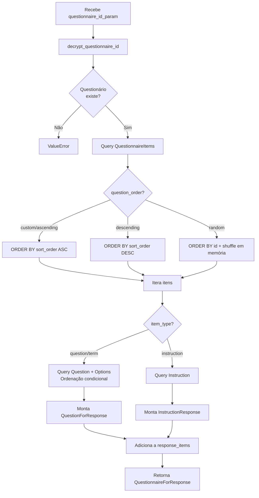

# 03 — Catálogo de Funções

## Backend

### `app/config.py`

#### `_get_public_ip(timeout: float = 5.0) -> str`
- **Linha:** 4
- **Objetivo:** Detecta o IP público da máquina para gerar links de questionários acessíveis externamente.
- **Parâmetros:** `timeout` — tempo máximo de espera por endpoint (padrão 5s)
- **Retorno:** `str` com IP ou `"localhost:8080"` como fallback
- **Fluxo:** Itera sobre 3 URLs (ipify, ifconfig.me, amazonaws); retorna o primeiro IP válido; em caso de falha total retorna `"localhost:8080"`
- **Exceções:** Silenciadas via `except Exception: continue`
- **Complexidade:** Baixa

---

### `app/database.py`

#### `get_db() -> Generator[Session, None, None]`
- **Linha:** 11
- **Objetivo:** FastAPI Dependency que fornece uma sessão de banco de dados com garantia de fechamento.
- **Retorno:** Gerador que yield `Session`; fecha no `finally`
- **Complexidade:** Baixa

---

### `app/utils/crypto.py`

#### `_normalize_encoded_id(raw_id: str) -> str`
- **Linha:** 6
- **Objetivo:** Normaliza IDs Base64 recebidos na URL: decodifica URL encoding e adiciona padding (`=`) necessário.
- **Parâmetros:** `raw_id` — string potencialmente URL-encoded e sem padding
- **Retorno:** `str` normalizado com padding correto
- **Complexidade:** Baixa

#### `encrypt_questionnaire_id(questionnaire_id: int) -> str`
- **Linha:** 18
- **Objetivo:** Codifica um ID inteiro em Base64 URL-safe sem padding (para uso em URLs).
- **Parâmetros:** `questionnaire_id: int`
- **Retorno:** `str` Base64 sem `=`
- **Complexidade:** Baixa

#### `decrypt_questionnaire_id(encoded_id: str) -> int`
- **Linha:** 24
- **Objetivo:** Decodifica um ID Base64 de volta para inteiro. Fallback: tenta converter direto como int (caso receba ID não codificado).
- **Parâmetros:** `encoded_id: str`
- **Retorno:** `int`
- **Exceções:** `ValueError("ID do questionário inválido")` se falhar ambos os métodos
- **Complexidade:** Baixa

#### `is_encrypted_id(id_param: str) -> bool`
- **Linha:** 36
- **Objetivo:** Determina se um `id_param` é Base64 ou inteiro direto.
- **Parâmetros:** `id_param: str`
- **Retorno:** `True` se Base64 válido, `False` se inteiro, `False` se inválido
- **Complexidade:** Baixa

---

### `app/services/user_service.py`

#### `UserService.create_user(db, user_data) -> User`
- **Linha:** 11
- **Objetivo:** Cria usuário com verificação de email duplicado e hashing de senha.
- **Parâmetros:** `db: Session`, `user_data: UserCreate`
- **Retorno:** `User` ORM
- **Exceções:** `ValueError("Email já registrado")`
- **Complexidade:** Baixa

#### `UserService.login_user(db, email, senha) -> LoginResponse`
- **Linha:** 72
- **Objetivo:** Autentica usuário via email + bcrypt. Retorna resposta com `user_id` e `nome_completo`.
- **Parâmetros:** `db: Session`, `email: str`, `senha: str`
- **Retorno:** `LoginResponse`
- **Exceções:** `ValueError("Email ou senha incorretos")` (mensagem genérica proposital para não revelar qual campo está errado)
- **Complexidade:** Baixa

#### `UserService.get_user_by_email(db, email) -> Optional[User]`
- **Linha:** 87
- **Objetivo:** Busca usuário por endereço de email. Retorna `None` se não encontrado (sem lançar exceção).
- **Parâmetros:** `db: Session`, `email: str`
- **Retorno:** `Optional[User]`
- **Complexidade:** Baixa

---

### `app/services/questionnaire_service.py`

#### `QuestionnaireService.get_questionnaire_for_response(db, questionnaire_id_param) -> QuestionnaireForResponse`
- **Linha:** 80
- **Objetivo:** Carrega um questionário para exibição ao respondente. Decodifica o ID Base64, ordena os itens conforme `question_order`, e para ordenação `random` embaralha os itens (e as opções) em memória. Popula questões e instruções a partir dos IDs nos `QuestionnaireItem`.
- **Parâmetros:** `db: Session`, `questionnaire_id_param: str` (Base64 ou int)
- **Retorno:** `QuestionnaireForResponse`
- **Exceções:** `ValueError` para ID inválido ou questionário não encontrado
- **Complexidade:** Alta — múltiplas queries, lógica de ordenação, construção de response objects

#### `QuestionnaireService.list_questionnaires(db, skip, limit) -> List[Questionnaire]`
- **Linha:** 157
- **Objetivo:** Lista todos os questionários com paginação offset/limit.
- **Parâmetros:** `db: Session`, `skip: int = 0`, `limit: int = 100`
- **Retorno:** `List[Questionnaire]`
- **Complexidade:** Baixa

#### `QuestionnaireService.get_questionnaire_by_id(db, questionnaire_id) -> Questionnaire`
- **Linha:** 163
- **Objetivo:** Busca questionário por ID. Lança exceção se não encontrado.
- **Parâmetros:** `db: Session`, `questionnaire_id: int`
- **Retorno:** `Questionnaire` ORM
- **Exceções:** `ValueError("Questionário não encontrado")`
- **Complexidade:** Baixa

#### `QuestionnaireService.update_questionnaire(db, questionnaire_id, questionnaire_data) -> Questionnaire`
- **Linha:** 265
- **Objetivo:** Atualiza título, descrição e ordem de um questionário. Bloqueia edição se já existirem submissões. Remove todos os `QuestionnaireItem` existentes e recria com os novos itens.
- **Parâmetros:** `db: Session`, `questionnaire_id: int`, `questionnaire_data: QuestionnaireCreate`
- **Retorno:** `Questionnaire` atualizado
- **Exceções:** `ValueError("Não é possível editar questionário com respostas")` ou `ValueError("Questionário não encontrado")`
- **Complexidade:** Média

#### `QuestionnaireService.delete_questionnaire(db, questionnaire_id) -> bool`
- **Linha:** 169
- **Objetivo:** Deleção manual em cascata completa (sem depender de ON DELETE CASCADE do banco).
- **Ordem de deleção:** Answers → QuestionnaireSubmissions → QuestionOptions → Questions → Instructions → QuestionnaireItems → Questionnaire
- **Complexidade:** Alta

#### `QuestionnaireService.generate_questionnaire_link(db, questionnaire_id) -> GenerateLinkResponse`
- **Linha:** 67
- **Objetivo:** Gera link público com ID criptografado. URL: `{frontend_base_url}/questionnaire/{encrypted_id}/respond`
- **Complexidade:** Baixa

---

### `app/services/question_service.py`

#### `QuestionService.add_option_to_question(db, question_id, option_data) -> QuestionOption`
- **Linha:** 77
- **Objetivo:** Adiciona uma nova opção a uma pergunta existente. Valida que a pergunta existe antes de inserir.
- **Parâmetros:** `db: Session`, `question_id: int`, `option_data: QuestionOptionCreate`
- **Retorno:** `QuestionOption` ORM criado
- **Exceções:** `ValueError("Pergunta não encontrada")`
- **Complexidade:** Baixa

#### `QuestionService.list_questions(db, skip, limit) -> List[Question]`
- **Linha:** 95
- **Objetivo:** Lista todas as perguntas com paginação offset/limit.
- **Parâmetros:** `db: Session`, `skip: int = 0`, `limit: int = 100`
- **Retorno:** `List[Question]`
- **Complexidade:** Baixa

---

### `app/services/response_service.py`

#### `ResponseService.validate_submission(db, submission_data) -> SubmissionValidationResponse`
- **Linha:** 12
- **Objetivo:** Valida uma submissão antes de persistir. Verifica: questionário existe e está ativo, perguntas pertencem ao questionário, perguntas obrigatórias foram todas respondidas, respostas são do tipo correto, opções selecionadas existem.
- **Parâmetros:** `db: Session`, `submission_data: SubmissionCreate`
- **Retorno:** `SubmissionValidationResponse` com `is_valid`, erros e warnings
- **Complexidade:** Alta

#### `ResponseService.calculate_answer_score(question, answer_data) -> float`
- **Linha:** 147
- **Objetivo:** Calcula pontuação de uma resposta.
  - `free_text`: sempre 0.0
  - `single`: peso da pergunta se opção correta, 0.0 se errado
  - `multiple`: peso total se todas corretas selecionadas; caso parcial: +1.0 por correta, -0.5 por errada (mínimo 0.0)
- **Complexidade:** Média

#### `ResponseService.submit_questionnaire_response(db, submission_data) -> QuestionnaireSubmission`
- **Linha:** 193
- **Objetivo:** Persiste submissão e respostas. Calcula scores individuais e total. Preenche "N/A" automaticamente para campos `free_text` opcionais não respondidos.
- **Complexidade:** Alta

#### `ResponseService.get_submission_by_id(db, submission_id) -> QuestionnaireSubmission`
- **Linha:** 265
- **Objetivo:** Busca uma submissão específica por ID.
- **Parâmetros:** `db: Session`, `submission_id: int`
- **Retorno:** `QuestionnaireSubmission` ORM
- **Exceções:** `ValueError("Submissão não encontrada")`
- **Complexidade:** Baixa

#### `ResponseService.delete_submission(db, submission_id) -> bool`
- **Linha:** 275
- **Objetivo:** Remove uma submissão e suas respostas associadas (via cascade do ORM).
- **Parâmetros:** `db: Session`, `submission_id: int`
- **Retorno:** `True`
- **Exceções:** `ValueError("Submissão não encontrada")`
- **Complexidade:** Baixa

#### `ResponseService.get_answers_by_question(db, questionnaire_id, question_id) -> List[Answer]`
- **Linha:** 315
- **Objetivo:** Retorna todas as respostas de uma questão específica dentro de um questionário, via JOIN entre `answers` e `questionnaire_submissions`.
- **Parâmetros:** `db: Session`, `questionnaire_id: int`, `question_id: int`
- **Retorno:** `List[Answer]`
- **Complexidade:** Baixa

---

### `app/services/report_service.py`

#### `ReportService.get_full_report(db, questionnaire_id) -> Dict`
- **Linha:** 12
- **Objetivo:** Relatório completo: carrega questionnaire + submissions + answers + questions + options em memória. Calcula total_correct/incorrect global. Percorre itens do questionário em ordem e calcula stats por questão (acurácia, distribuição de opções, score médio). Monta lista de `anonymous_submissions` com respostas expandidas (inclui texto das opções selecionadas).
- **Complexidade:** Muito Alta (>100 linhas, múltiplos loops aninhados)

#### `ReportService.custom_export(db, questionnaire_id, question_ids, meta_fields, date_from, date_to) -> Dict`
- **Linha:** 257
- **Objetivo:** Exportação wide-format. Filtra submissions por data no banco. Carrega apenas respostas das questões selecionadas. Monta linhas onde cada questão é uma coluna (formato tabular).
- **Retorno:** `{column_keys, column_labels, rows, total}`
- **Complexidade:** Alta

---

### `app/services/analytics_service.py`

#### `AnalyticsService.compute_descriptive_stats(values) -> Dict`
- **Linha:** 21
- **Objetivo:** Calcula média, DP (ddof=1), moda (scipy), mediana, IIQ, min, max, n usando numpy/scipy.
- **Parâmetros:** `values: List[float]`
- **Retorno:** Dict com 8 chaves
- **Complexidade:** Baixa

#### `AnalyticsService.compute_chyps_v_scores(submissions, caption_to_options) -> Dict`
- **Linha:** 57
- **Objetivo:** Score CHYPS-V para todos os respondentes. Para cada submissão: busca respostas pelos captions Q1-Q20, re-calcula pesos via `_re_score_answer`, soma score global e por subescala. Calcula stats descritivas globais e por subescala, alpha de Cronbach e correlação de Spearman se n > 1.
- **Complexidade:** Muito Alta

#### `AnalyticsService.compute_cronbachs_alpha(item_matrix) -> float`
- **Linha:** 140
- **Objetivo:** Calcula α = (k/(k-1)) * (1 - Σvar(itens) / var(total)).
- **Parâmetros:** `item_matrix: List[List[float]]` — matriz respondentes × itens
- **Retorno:** `float` (0.0 se dados insuficientes)
- **Complexidade:** Baixa

#### `AnalyticsService.compute_crosstab(row_values, col_values) -> Dict`
- **Linha:** 157
- **Objetivo:** Tabulação cruzada com qui-quadrado (scipy). Cria tabela de contingência e testa independência.
- **Retorno:** `{table, row_labels, col_labels, chi_square, p_value, degrees_of_freedom}`
- **Complexidade:** Média

#### `AnalyticsService.filter_submissions(submissions, filters) -> List[Dict]`
- **Linha:** 201
- **Objetivo:** Filtra lista de submissões pelos filtros demográficos configurados em `DEMOGRAPHIC_FILTERS`. Suporta filtros por ano (range min/max) e categorias (lista de valores permitidos).
- **Complexidade:** Média

#### `AnalyticsService.compute_question_distributions(question_stats) -> List[Dict]`
- **Linha:** 240
- **Objetivo:** Classifica questões em `pie` (2 opções), `bar` (3+ opções), `text_table` (free_text), `none` (sem opções). Calcula percentagens.
- **Complexidade:** Média

---

### `app/api/v1/endpoints/reports.py`

#### `slugify(text, length=5) -> str`
- **Linha:** 298
- **Objetivo:** Converte texto em slug URL-safe para uso como nome de coluna CSV. Remove caracteres não alfanuméricos, converte para minúsculas, trunca a 5 chars.
- **Complexidade:** Baixa

#### `get_full_report(questionnaire_id, db, report_service) -> Dict`
- **Linha:** 15
- **Objetivo:** Endpoint `GET /reports/questionnaires/{id}/full-report`. Delega ao `ReportService.get_full_report`.
- **Erros:** HTTP 404 via `ValueError`
- **Complexidade:** Baixa (wrapper)

#### `get_summary_report(questionnaire_id, db, report_service) -> Dict`
- **Linha:** 27
- **Objetivo:** Endpoint `GET /reports/questionnaires/{id}/summary`. Delega ao `ReportService.get_summary_report`.
- **Erros:** HTTP 404 via `ValueError`
- **Complexidade:** Baixa (wrapper)

#### `export_report(questionnaire_id, format) -> Response`
- **Linha:** 40
- **Objetivo:** Exportação CSV ou JSON do relatório completo. CSV usa captions como nome de coluna quando disponível; usa `slugify(question_text)[:5]` como fallback. JSON inclui metadados do questionário.
- **Complexidade:** Alta

#### `get_analytics(questionnaire_id, db, report_service) -> Dict`
- **Linha:** 173
- **Objetivo:** Endpoint `GET /reports/questionnaires/{id}/analytics`. Calcula distribuição de scores (min/max/mean/median/std), top 5 scores, 5 perguntas mais difíceis por acurácia e distribuição de performance (excelente/boa/média/fraca) diretamente na função do endpoint, sem delegar a um service.
- **Parâmetros:** `questionnaire_id: int`, `db: DatabaseDep`, `report_service: ReportServiceDep`
- **Retorno:** Dict com `score_distribution`, `top_scores`, `difficult_questions`, `performance_distribution`
- **Erros:** HTTP 404 via `ValueError`; retorna `{"message": "Nenhuma resposta encontrada"}` se sem dados
- **Complexidade:** Média

#### `get_question_analysis(questionnaire_id, question_id, db, report_service) -> Dict`
- **Linha:** 218
- **Objetivo:** Endpoint `GET /reports/questionnaires/{id}/questions/{q_id}/analysis`. Delega ao `ReportService.get_question_analysis`.
- **Erros:** HTTP 404 via `ValueError`
- **Complexidade:** Baixa (wrapper)

#### `custom_export(questionnaire_id, body) -> Response`
- **Linha:** 230
- **Objetivo:** Exportação CSV/XLSX/JSON personalizada. Delega ao `ReportService.custom_export` para filtrar dados. Para XLSX usa `openpyxl` importado localmente.
- **Complexidade:** Alta

---

---

### `app/api/v1/endpoints/questionnaires.py`

#### `create_instruction(instruction, db, questionnaire_service) -> InstructionResponse`
- **Linha:** 14
- **Objetivo:** `POST /questionnaires/instructions` — cria instrução de texto.
- **Erros:** HTTP 400 via `ValueError`
- **Complexidade:** Baixa (wrapper)

#### `create_questionnaire(questionnaire, db, questionnaire_service) -> QuestionnaireResponse`
- **Linha:** 26
- **Objetivo:** `POST /questionnaires/` — cria novo questionário com itens.
- **Erros:** HTTP 400 via `ValueError`
- **Complexidade:** Baixa (wrapper)

#### `generate_questionnaire_link(questionnaire_id, db, questionnaire_service) -> GenerateLinkResponse`
- **Linha:** 38
- **Objetivo:** `POST /questionnaires/{id}/generate-link` — gera link público com ID criptografado.
- **Erros:** HTTP 404 via `ValueError`
- **Complexidade:** Baixa (wrapper)

#### `get_questionnaire_for_response(questionnaire_id, db, questionnaire_service) -> QuestionnaireForResponse`
- **Linha:** 50
- **Objetivo:** `GET /questionnaires/{id}/respond` — carrega questionário para o respondente. Trata IDs inválidos com HTTP 404 e erros inesperados com HTTP 500 sem expor detalhes.
- **Complexidade:** Baixa (wrapper com tratamento de exceção diferenciado)

#### `list_questionnaires(db, questionnaire_service, skip, limit, criador_id) -> List[QuestionnaireResponse]`
- **Linha:** 70
- **Objetivo:** `GET /questionnaires/` — lista todos os questionários ou filtra por `criador_id`.
- **Complexidade:** Baixa

#### `get_questionnaire(questionnaire_id, db, questionnaire_service) -> QuestionnaireResponse`
- **Linha:** 85
- **Objetivo:** `GET /questionnaires/{id}` — retorna questionário por ID.
- **Erros:** HTTP 404 via `ValueError`
- **Complexidade:** Baixa (wrapper)

#### `delete_questionnaire(questionnaire_id, db, questionnaire_service) -> dict`
- **Linha:** 97
- **Objetivo:** `DELETE /questionnaires/{id}` — remove questionário e todos os dados em cascata.
- **Retorno:** `{"deleted": True}`
- **Erros:** HTTP 404 via `ValueError`
- **Complexidade:** Baixa (wrapper)

#### `check_questionnaire_eligibility(questionnaire_id, db, questionnaire_service) -> dict`
- **Linha:** 109
- **Objetivo:** `GET /questionnaires/{id}/eligibility` — verifica se o questionário pode ser editado (sem respostas).
- **Retorno:** `{"eligible": bool}`
- **Erros:** HTTP 404 via `ValueError`
- **Complexidade:** Baixa (wrapper)

#### `update_questionnaire(questionnaire_id, questionnaire, db, questionnaire_service) -> QuestionnaireResponse`
- **Linha:** 121
- **Objetivo:** `PUT /questionnaires/{id}` — atualiza questionário (bloqueado se tiver respostas).
- **Erros:** HTTP 400 via `ValueError`
- **Complexidade:** Baixa (wrapper)

#### `update_instruction(instruction_id, instruction, db, questionnaire_service) -> InstructionResponse`
- **Linha:** 134
- **Objetivo:** `PUT /questionnaires/instructions/{id}` — atualiza texto de instrução.
- **Erros:** HTTP 404 via `ValueError`
- **Complexidade:** Baixa (wrapper)

---

### `app/api/v1/endpoints/users.py`

#### `create_user(user, db, user_service) -> UserResponse`
- **Linha:** 8
- **Objetivo:** `POST /users/` — cadastra novo usuário.
- **Erros:** HTTP 400 via `ValueError` (email duplicado)
- **Complexidade:** Baixa (wrapper)

#### `get_user(user_id, db, user_service) -> UserResponse`
- **Linha:** 20
- **Objetivo:** `GET /users/{id}` — retorna dados do usuário por ID.
- **Erros:** HTTP 404 via `ValueError`
- **Complexidade:** Baixa (wrapper)

#### `update_user(user_id, user_update, db, user_service) -> UserResponse`
- **Linha:** 32
- **Objetivo:** `PUT /users/{id}` — atualiza dados do usuário.
- **Erros:** HTTP 404 via `ValueError`
- **Complexidade:** Baixa (wrapper)

#### `delete_user(user_id, db, user_service) -> dict`
- **Linha:** 45
- **Objetivo:** `DELETE /users/{id}` — remove usuário.
- **Retorno:** `{"message": "Usuário deletado com sucesso"}`
- **Erros:** HTTP 404 via `ValueError`
- **Complexidade:** Baixa (wrapper)

#### `list_users(db, user_service, skip, limit) -> List[UserResponse]`
- **Linha:** 57
- **Objetivo:** `GET /users/` — lista usuários com paginação.
- **Complexidade:** Baixa (wrapper)

#### `login(login_data, db, user_service) -> LoginResponse`
- **Linha:** 67
- **Objetivo:** `POST /users/login` — autentica usuário por email e senha.
- **Erros:** HTTP 401 via `ValueError`
- **Complexidade:** Baixa (wrapper)

---

### `app/api/v1/endpoints/questions.py`

#### `create_question(question, db, question_service) -> QuestionResponse`
- **Linha:** 9
- **Objetivo:** `POST /questions/` — cria pergunta com opções.
- **Erros:** HTTP 400 via `ValueError` (caption duplicado ou erro de integridade)
- **Complexidade:** Baixa (wrapper)

#### `get_question(question_id, db, question_service) -> QuestionResponse`
- **Linha:** 21
- **Objetivo:** `GET /questions/{id}` — retorna pergunta por ID.
- **Erros:** HTTP 404 via `ValueError`
- **Complexidade:** Baixa (wrapper)

#### `get_question_by_caption(caption, db, question_service) -> QuestionResponse`
- **Linha:** 33
- **Objetivo:** `GET /questions/by-caption/{caption}` — busca pergunta por caption único.
- **Erros:** HTTP 404 via `ValueError`
- **Complexidade:** Baixa (wrapper)

#### `add_option_to_question(question_id, option, db, question_service) -> QuestionOptionResponse`
- **Linha:** 45
- **Objetivo:** `POST /questions/{id}/options` — adiciona opção a pergunta existente.
- **Erros:** HTTP 404 via `ValueError`
- **Complexidade:** Baixa (wrapper)

#### `list_questions(db, question_service, skip, limit) -> List[QuestionResponse]`
- **Linha:** 58
- **Objetivo:** `GET /questions/` — lista perguntas com paginação.
- **Complexidade:** Baixa (wrapper)

#### `delete_question(question_id, db, question_service) -> dict`
- **Linha:** 68
- **Objetivo:** `DELETE /questions/{id}` — remove pergunta.
- **Retorno:** `{"message": "Pergunta deletada com sucesso"}`
- **Erros:** HTTP 404 via `ValueError`
- **Complexidade:** Baixa (wrapper)

#### `update_question(question_id, question_data, db, question_service) -> dict`
- **Linha:** 80
- **Objetivo:** `PUT /questions/{id}` — atualiza pergunta e suas opções (recria opções).
- **Retorno:** `{"id": int, "message": "Pergunta atualizada com sucesso"}`
- **Erros:** HTTP 404/500 via exceção
- **Complexidade:** Baixa (wrapper)

---

### `app/api/v1/endpoints/responses.py`

#### `submit_questionnaire_response(submission, db, response_service) -> JSONResponse`
- **Linha:** 10
- **Objetivo:** `POST /responses/submit` — valida e persiste submissão. Retorna erros estruturados (HTTP 400) se validação falhar, incluindo detalhes de quais questões estão faltando.
- **Retorno (sucesso):** `{"success": True, "data": {"id", "questionnaire_id", "total_score", "submitted_at", "answers_count"}}`
- **Retorno (falha de validação):** `{"success": False, "validation_details": {...}, "errors": [...]}`
- **Complexidade:** Média

#### `get_submission(submission_id, db, response_service) -> SubmissionResponse`
- **Linha:** 85
- **Objetivo:** `GET /responses/submissions/{id}` — retorna submissão por ID.
- **Erros:** HTTP 404 via `ValueError`
- **Complexidade:** Baixa (wrapper)

#### `list_questionnaire_submissions(questionnaire_id, db, response_service, limit, skip) -> List[SubmissionResponse]`
- **Linha:** 109
- **Objetivo:** `GET /responses/questionnaires/{id}/submissions` — lista submissões com paginação em memória (não usa LIMIT/OFFSET SQL).
- **Complexidade:** Baixa

#### `get_submission_statistics(questionnaire_id, db, response_service) -> JSONResponse`
- **Linha:** 136
- **Objetivo:** `GET /responses/questionnaires/{id}/statistics` — retorna estatísticas rápidas das submissões.
- **Retorno:** `{"success": True, "data": {"total_submissions", "average_score", "max_score", "min_score", "median_score", "latest_submission"}}`
- **Complexidade:** Baixa (wrapper)

#### `delete_submission(submission_id, db, response_service) -> JSONResponse`
- **Linha:** 166
- **Objetivo:** `DELETE /responses/submissions/{id}` — remove submissão.
- **Erros:** HTTP 404 via `ValueError`; HTTP 500 para erros inesperados
- **Complexidade:** Baixa (wrapper)

---

### `app/api/v1/endpoints/analytics.py`

#### `_build_caption_option_map(db, questionnaire_id) -> dict`
- **Linha:** 271
- **Objetivo:** Constrói mapa `{caption: [{id, text, weight}]}` de todas as questões com caption de um questionário. Usado para re-scoring CHYPS-V com pesos corretos.
- **Complexidade:** Baixa

#### `_extract_variable_values(submissions, variable) -> list`
- **Linha:** 292
- **Objetivo:** Extrai valores de uma variável (caption ou question_id) de todas as submissões para uso no crosstab.
- **Complexidade:** Baixa

#### `_compute_filter_options(submissions) -> dict`
- **Linha:** 309
- **Objetivo:** Extrai valores únicos disponíveis para cada filtro demográfico a partir das submissões. Para `birth_year` extrai o ano da string DD/MM/YYYY.
- **Complexidade:** Média

---

## Frontend

### `frontend/utils/validators.py`

#### `Validators.validate_email(email) -> Tuple[bool, str]`
- **Linha:** 7
- **Objetivo:** Valida formato de email com regex.
- **Complexidade:** Baixa

#### `Validators.validate_password(password) -> Tuple[bool, str]`
- **Linha:** 12
- **Objetivo:** Valida senha mínima de 6 caracteres.
- **Complexidade:** Baixa

#### `Validators.validate_age(age) -> Tuple[bool, str]`
- **Linha:** 19
- **Objetivo:** Valida que a idade está no intervalo aceitável (1 a 120 anos).
- **Parâmetros:** `age: int`
- **Retorno:** `(True, "")` se válido; `(False, "Idade deve estar entre 1 e 120 anos")` se inválido
- **Complexidade:** Baixa

#### `Validators.validate_phone(phone) -> Tuple[bool, str]`
- **Linha:** 24
- **Objetivo:** Valida telefone pelo padrão `(XX) XXXXX-XXXX` (regex) ou por ter no mínimo 10 dígitos após remover formatação.
- **Parâmetros:** `phone: str`
- **Retorno:** `(True, "")` se válido; `(False, "Telefone inválido")` se inválido
- **Complexidade:** Baixa

---

### `frontend/services/api_client.py`

#### `APIClient._safe_user_message(status_code, default_msg) -> str`
- **Linha:** 11
- **Objetivo:** Mapeia códigos HTTP para mensagens amigáveis. 404 → "Questionário não encontrado", 500+ → mensagem genérica.
- **Complexidade:** Baixa

---

### `frontend/services/questionnaire_service.py`

#### `QuestionnaireService.create_questionnaire(payload) -> Optional[Dict]`
- **Linha:** 7
- **Objetivo:** `POST /questionnaires/` — cria questionário.
- **Complexidade:** Baixa (wrapper)

#### `QuestionnaireService.generate_link(questionnaire_id) -> Optional[Dict]`
- **Linha:** 11
- **Objetivo:** `POST /questionnaires/{id}/generate-link` — obtém link público.
- **Complexidade:** Baixa (wrapper)

#### `QuestionnaireService.list_by_creator(criador_id) -> Optional[List]`
- **Linha:** 15
- **Objetivo:** `GET /questionnaires/?criador_id={id}` — lista questionários do criador.
- **Complexidade:** Baixa (wrapper)

#### `QuestionnaireService.delete(questionnaire_id) -> bool`
- **Linha:** 19
- **Objetivo:** `DELETE /questionnaires/{id}` — remove questionário.
- **Complexidade:** Baixa (wrapper)

#### `QuestionnaireService.get_questionnaire_for_response(questionnaire_id) -> Optional[Dict]`
- **Linha:** 24
- **Objetivo:** `GET /questionnaires/{id}/respond` — carrega estrutura para resposta.
- **Complexidade:** Baixa (wrapper)

#### `QuestionnaireService.check_eligibility(questionnaire_id) -> Optional[Dict]`
- **Linha:** 28
- **Objetivo:** `GET /questionnaires/{id}/eligibility` — verifica se pode ser editado.
- **Complexidade:** Baixa (wrapper)

#### `QuestionnaireService.update_questionnaire(questionnaire_id, payload) -> Optional[Dict]`
- **Linha:** 32
- **Objetivo:** `PUT /questionnaires/{id}` — atualiza questionário.
- **Complexidade:** Baixa (wrapper)

---

### `frontend/services/user_service.py`

#### `UserService.create_user(user_data) -> Optional[Dict]`
- **Linha:** 7
- **Objetivo:** `POST /users/` — cadastra novo usuário.
- **Complexidade:** Baixa (wrapper)

#### `UserService.get_user(user_id) -> Optional[Dict]`
- **Linha:** 11
- **Objetivo:** `GET /users/{id}` — retorna dados do usuário.
- **Complexidade:** Baixa (wrapper)

#### `UserService.list_users() -> Optional[List]`
- **Linha:** 15
- **Objetivo:** `GET /users/` — lista usuários.
- **Complexidade:** Baixa (wrapper)

#### `UserService.authenticate_user(email, password) -> Optional[Dict]`
- **Linha:** 19
- **Objetivo:** `POST /users/login` e, se bem-sucedido, `GET /users/{id}` para obter dados completos do usuário. Retorna dict do usuário ou `None`.
- **Complexidade:** Baixa (dois passos HTTP)

#### `UserService.login_user(email, password) -> Optional[Dict]`
- **Linha:** 43
- **Objetivo:** `POST /users/login` — retorna apenas a `LoginResponse` sem buscar dados completos.
- **Complexidade:** Baixa (wrapper)

---

### `frontend/services/response_service.py`

#### `ResponseService.submit_response(submission_data) -> Optional[Dict]`
- **Linha:** 8
- **Objetivo:** `POST /responses/submit` — envia respostas do respondente.
- **Complexidade:** Baixa (wrapper)

#### `ResponseService.get_submission(submission_id) -> Optional[Dict]`
- **Linha:** 12
- **Objetivo:** `GET /responses/submissions/{id}` — obtém submissão por ID.
- **Complexidade:** Baixa (wrapper)

---

### `frontend/services/report_service.py`

#### `ReportService.get_full_report(questionnaire_id) -> Optional[Dict]`
- **Linha:** 10
- **Objetivo:** `GET /reports/questionnaires/{id}/full-report` — obtém relatório completo.
- **Complexidade:** Baixa (wrapper)

#### `ReportService.get_summary_report(questionnaire_id) -> Optional[Dict]`
- **Linha:** 14
- **Objetivo:** `GET /reports/questionnaires/{id}/summary` — obtém resumo numérico.
- **Complexidade:** Baixa (wrapper)

#### `ReportService.get_analytics(questionnaire_id) -> Optional[Dict]`
- **Linha:** 18
- **Objetivo:** `GET /reports/questionnaires/{id}/analytics` — obtém analytics simplificados (distribuição de scores, top performers, questões difíceis).
- **Complexidade:** Baixa (wrapper)

#### `ReportService.download_report(questionnaire_id, format_type) -> bool`
- **Linha:** 22
- **Objetivo:** `GET /reports/questionnaires/{id}/export?format={csv|json}` — faz download do relatório via `requests.get` direto (fora do `api_client`), e dispara `ui.download` com o conteúdo binário.
- **Parâmetros:** `questionnaire_id: int`, `format_type: str` (`"csv"` ou `"json"`)
- **Retorno:** `True` se HTTP 200, `False` caso contrário
- **Complexidade:** Baixa

#### `ReportService.download_csv_report(questionnaire_id) -> bool`
- **Linha:** 38
- **Objetivo:** Atalho que chama `download_report(questionnaire_id, "csv")`.
- **Complexidade:** Baixa

#### `ReportService.download_json_report(questionnaire_id) -> bool`
- **Linha:** 41
- **Objetivo:** Atalho que chama `download_report(questionnaire_id, "json")`.
- **Complexidade:** Baixa

#### `ReportService.custom_export(questionnaire_id, question_ids, meta_fields, date_from, date_to, format_type) -> bytes`
- **Linha:** 46
- **Objetivo:** `POST /reports/questionnaires/{id}/custom-export` — exportação personalizada com payload JSON. Lança `Exception` com detalhes do backend em caso de HTTP 404 ou outros erros.
- **Retorno:** `bytes` com o conteúdo do arquivo exportado
- **Complexidade:** Baixa

---

### `frontend/services/analytics_service.py`

#### `AnalyticsService.get_dashboard_data(questionnaire_id) -> Optional[Dict]`
- **Linha:** 7
- **Objetivo:** `GET /analytics/questionnaires/{id}/dashboard-data` — dados completos do dashboard.
- **Complexidade:** Baixa (wrapper)

#### `AnalyticsService.get_filtered_analytics(questionnaire_id, filters) -> Optional[Dict]`
- **Linha:** 15
- **Objetivo:** `POST /analytics/questionnaires/{id}/filtered-analytics` — re-calcula analytics com filtros demográficos aplicados.
- **Complexidade:** Baixa (wrapper)

#### `AnalyticsService.get_chyps_scores(questionnaire_id, filters) -> Optional[Dict]`
- **Linha:** 26
- **Objetivo:** `POST /analytics/questionnaires/{id}/chyps-scores` — scores CHYPS-V com filtros opcionais.
- **Complexidade:** Baixa (wrapper)

#### `AnalyticsService.get_crosstab(questionnaire_id, row_variable, col_variable, filters) -> Optional[Dict]`
- **Linha:** 36
- **Objetivo:** `POST /analytics/questionnaires/{id}/crosstab` — tabulação cruzada entre duas variáveis.
- **Complexidade:** Baixa (wrapper)

#### `AnalyticsService.get_question_distributions(questionnaire_id) -> Optional[Dict]`
- **Linha:** 54
- **Objetivo:** `GET /analytics/questionnaires/{id}/question-distributions` — distribuição de respostas por questão.
- **Complexidade:** Baixa (wrapper)

#### `AnalyticsService.get_text_responses(questionnaire_id, question_id, search, page, page_size, filters) -> Optional[Dict]`
- **Linha:** 62
- **Objetivo:** `POST /analytics/questionnaires/{id}/text-responses` — respostas de texto livre paginadas com busca textual e filtros.
- **Complexidade:** Baixa (wrapper)

#### `AnalyticsService.get_filter_options(questionnaire_id) -> Optional[Dict]`
- **Linha:** 84
- **Objetivo:** `GET /analytics/questionnaires/{id}/filter-options` — opções disponíveis para filtros (valores únicos de diagnóstico, medicação, anos).
- **Complexidade:** Baixa (wrapper)

#### `AnalyticsService.get_crosstab_variables(questionnaire_id) -> Optional[Dict]`
- **Linha:** 92
- **Objetivo:** `GET /analytics/questionnaires/{id}/crosstab-variables` — variáveis disponíveis para uso no crosstab.
- **Complexidade:** Baixa (wrapper)

---

### `frontend/services/question_service.py`

#### `QuestionClient.create_question(payload) -> Optional[Dict]`
- **Linha:** 6
- **Objetivo:** `POST /questions/` — cria pergunta com opções.
- **Complexidade:** Baixa (wrapper)

---

### `frontend/services/instruction_service.py`

#### `InstructionClient.create_instruction(payload) -> Optional[Dict]`
- **Linha:** 4
- **Objetivo:** `POST /questionnaires/instructions` — cria instrução de texto.
- **Complexidade:** Baixa (wrapper)

---

### `frontend/services/custom_export_service.py`

#### `CustomExportService.to_csv(rows, columns) -> bytes`
- **Linha:** 14
- **Objetivo:** Converte lista de dicts para CSV em bytes (UTF-8 com BOM para compatibilidade com Excel). Usa `csv.DictWriter`.
- **Complexidade:** Baixa

#### `CustomExportService.to_json(rows) -> bytes`
- **Linha:** 20
- **Objetivo:** Converte lista de dicts para JSON formatado em bytes (UTF-8, `indent=2`, `ensure_ascii=False`).
- **Complexidade:** Baixa

#### `CustomExportService.to_xlsx(rows, columns, labels) -> bytes`
- **Linha:** 23
- **Objetivo:** Converte lista de dicts para XLSX via `openpyxl`. Usa `labels` para traduzir nomes de colunas no cabeçalho.
- **Complexidade:** Baixa

---

### `frontend/pages/questionnaire_answer_page.py`

#### `QuestionnaireAnswerPage._is_date_of_birth_field(question_text) -> bool`
- **Linha:** 296
- **Objetivo:** Heurística para detectar campo de data de nascimento pelo texto da questão. Procura "nascimento" ou padrão `__/__/____`.
- **Complexidade:** Baixa

#### `QuestionnaireAnswerPage._validate_answers() -> Tuple[bool, str]`
- **Linha:** 358
- **Objetivo:** Validação client-side antes de submeter: verifica se todas as questões obrigatórias foram respondidas.
- **Complexidade:** Média

#### `QuestionnaireAnswerPage._format_term_text(text) -> str`
- **Linha:** 237
- **Objetivo:** Detecta se o texto já é HTML (procura tags) e retorna como-é; caso contrário, escapa e substitui `\n` por ` `.
- **Complexidade:** Baixa

---

### `frontend/pages/questionnaire_create_page.py`

#### `questionnaire_create_page(on_done, on_cancel, questionnaire_id)`
- **Linha:** 26
- **Objetivo:** Função-página que encapsula todo o estado do editor em um `state` dict local (closure). Não é uma classe — padrão funcional com closures para callbacks.
- **Funções internas principais:**
  - `_save()`: sincroniza dados → valida → cria/atualiza itens um por um → cria/atualiza questionário
  - `_validate()`: valida título, itens, textos, opções com is_correct
  - `_sync_all_editors_data()`: sincroniza todos os `QuestionItemEditor` com o `state['items']`
  - `_load_questionnaire_data()`: carrega dados para modo edição
  - `_handle_item_reorder(e)`: trata drag-and-drop de itens
- **Complexidade:** Muito Alta

---

### `frontend/pages/report_detailed.py`

#### `_passthrough_html(value) -> str`
- **Linha:** 41
- **Objetivo:** Retorna o valor sem modificação. Função identidade usada como placeholder para rendering de HTML.
- **Complexidade:** Baixa

#### `_matches_patterns(text, patterns) -> bool`
- **Linha:** 45
- **Objetivo:** Verifica se algum dos padrões (case-insensitive) está presente no texto.
- **Parâmetros:** `text: str`, `patterns: list`
- **Retorno:** `True` se qualquer padrão for encontrado
- **Complexidade:** Baixa

#### `_force_pie(question_text) -> bool`
- **Linha:** 58
- **Objetivo:** Determina se uma questão deve ser forçosamente exibida como gráfico pizza (ignora o critério de 2 opções). Ativa para questões de raça/etnia, sexo e definição de desconforto.
- **Parâmetros:** `question_text: str`
- **Complexidade:** Baixa

#### `_is_birthday(question_text) -> bool`
- **Linha:** 62
- **Objetivo:** Detecta campos de data de nascimento pelo padrão `"data de nascimento"` no texto.
- **Complexidade:** Baixa

#### `_is_observation(question_text) -> bool`
- **Linha:** 66
- **Objetivo:** Detecta campos de observação pelos padrões `"observação"`, `"observacao"`, `"obs:"`.
- **Complexidade:** Baixa

#### `_is_discomfort_definition(question_text) -> bool`
- **Linha:** 71
- **Objetivo:** Detecta a questão de definição de desconforto pelo padrão `"indique o que queremos dizer"`.
- **Complexidade:** Baixa

#### `_truncate_discomfort_labels(labels) -> list`
- **Linha:** 75
- **Objetivo:** Trunca o rótulo no índice 3 da lista (4ª opção da questão de definição de desconforto) para evitar labels muito longos no gráfico. Trunca na primeira vírgula ou em 15 caracteres.
- **Parâmetros:** `labels: list`
- **Retorno:** Lista de labels com o 4º item possivelmente truncado
- **Complexidade:** Baixa

#### `_is_excluded(question_text, question_title) -> bool`
- **Linha:** 50
- **Objetivo:** Verifica se uma questão deve ser excluída do relatório (TCLE, Nome, Email).
- **Complexidade:** Baixa

#### `QuestionnaireDetailedReport._refresh_dynamic_sections()`
- **Linha:** 514
- **Objetivo:** Re-renderiza somente as seções analíticas (Summary, ScoreHist, Subscale, Reliability, Spearman) após aplicação de filtros, sem re-carregar questões ou dados base.
- **Complexidade:** Alta

---

### `frontend/pages/custom_export_page.py`

#### `CustomExportPage._group_questions(questions) -> list`
- **Linha:** 322
- **Objetivo:** Classifica questões em 3 grupos: sociodemográfico (caption começa com 'T'), instrumento (caption começa com 'Q'), outros. Retorna lista de tuplas `(key, label, questions)`.
- **Complexidade:** Baixa

#### `CustomExportPage._extract_questions_from_structure(qr) -> list`
- **Linha:** 225
- **Objetivo:** Extrai lista de questões da estrutura de um questionário (/respond endpoint) para uso no seletor de exportação.
- **Complexidade:** Baixa

---

### `frontend/components/questionnaire/question_item_editor.py`

#### `_fresh_value(e, widget, default='') -> str`
- **Linha:** 14
- **Objetivo:** Resolve o problema de valores stale do NiceGUI: se o evento `e` veio do widget, usa o valor do evento; caso contrário, usa `widget.value`. Evita perda do último caractere digitado.
- **Complexidade:** Baixa

#### `QuestionItemEditor._sync_all_options_data()`
- **Linha:** 223
- **Objetivo:** Sincroniza os valores dos widgets de opções (texto, correto, peso) para os dicts em `item_data['options']`, usando `id(opt)` como chave de mapeamento.
- **Complexidade:** Média

---

### `frontend/components/shared/plotly_config.py`

#### `get_plotly_config() -> dict`
- **Linha:** 12
- **Objetivo:** Retorna o dict de configuração padrão do Plotly para uso em `ui.plotly`. Habilita a barra de ferramentas (`displayModeBar`) e modo responsivo.
- **Retorno:** `{"displayModeBar": True, "responsive": True}`
- **Complexidade:** Baixa

#### `_base_layout(title, height) -> dict`
- **Linha:** 19
- **Objetivo:** Constrói o dict de layout base para figuras Plotly com fonte `Inter`, margens padrão, fundo branco e altura configurável.
- **Parâmetros:** `title: str`, `height: int = 350`
- **Retorno:** Dict de layout Plotly
- **Complexidade:** Baixa

#### `create_pie_chart(labels, values, title, height) -> go.Figure`
- **Linha:** 30
- **Objetivo:** Cria gráfico pizza Plotly com palette Set1 (máx. 9 cores), furo de 35%, rótulos externos com percentagem. Usa `_base_layout`.
- **Complexidade:** Baixa

#### `create_bar_chart(labels, counts, percentages, title, height) -> go.Figure`
- **Linha:** 52
- **Objetivo:** Cria gráfico de barras Plotly com texto `"N (P%)"` acima de cada barra, palette Set1, ângulo de rotação no eixo X quando labels longos. Usa `_base_layout`.
- **Complexidade:** Baixa

#### `create_histogram(values, title, x_label, nbins, height, use_set1) -> go.Figure`
- **Linha:** 81
- **Objetivo:** Cria histograma com palette Set1 (uma cor por bin, via `np.histogram` manual) quando `use_set1=True`. Fallback para `go.Histogram` simples.
- **Complexidade:** Média

#### `create_correlation_heatmap(matrix, labels, title, height, width) -> go.Figure`
- **Linha:** 132
- **Objetivo:** Cria heatmap de correlação com colorscale PiYG, range -1 a 1, anotações com ρ arredondado a 2 casas. Eixo Y invertido.
- **Complexidade:** Baixa
