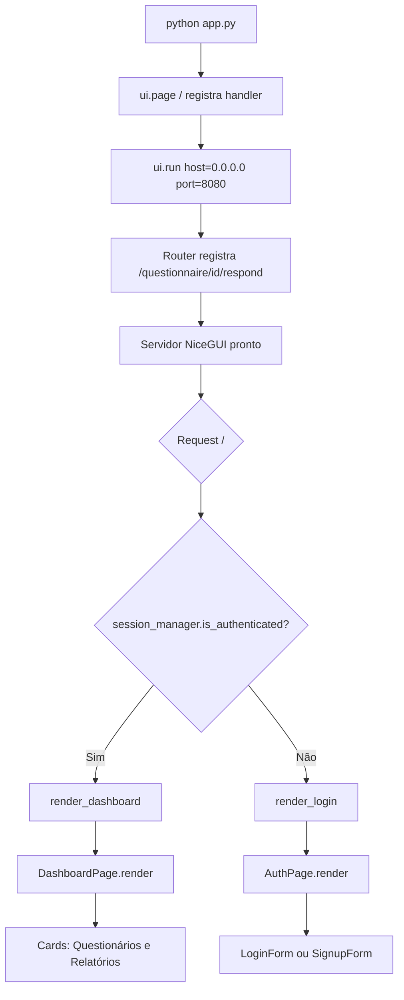
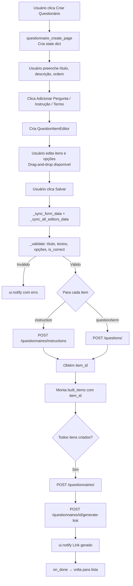
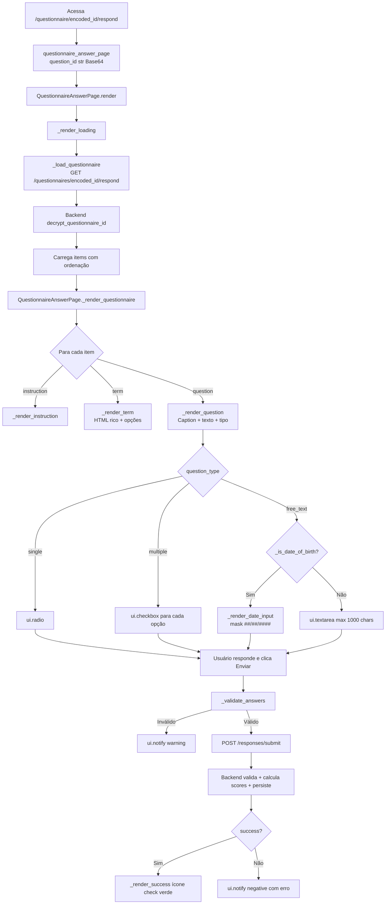
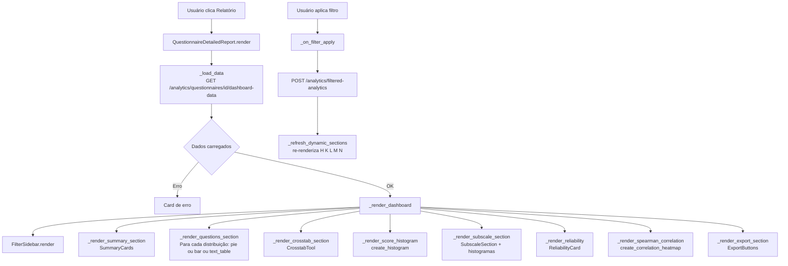
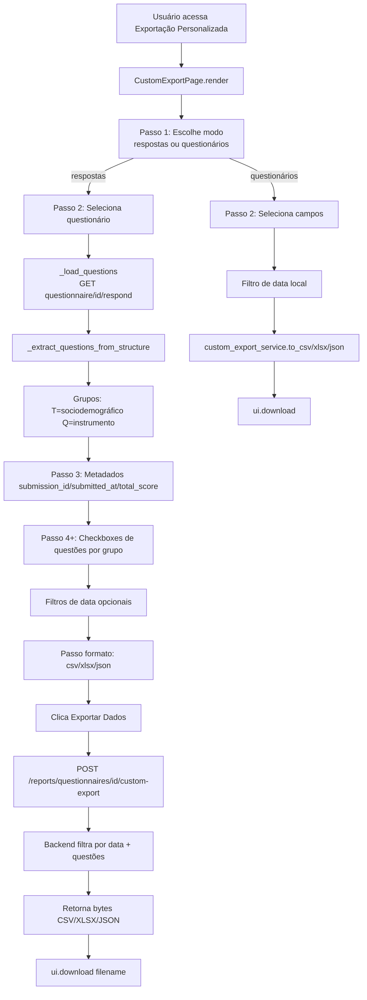

# 04 — Fluxos de Execução

## Pontos de Entrada

| Ponto | Comando | Porta |
|---|---|---|
| Backend | `uvicorn app.main:app --host 0.0.0.0 --port 8000` | 8000 (interno) |
| Frontend | `python app.py` | 8080 (interno) |
| Proxy | nginx (via docker-compose) | 8080 (externo) |

---

## Fluxo 1: Inicialização do Backend

```mermaid
flowchart TD
    A[uvicorn app.main:app] --> B[Base.metadata.create_all\ncria tabelas se não existirem]
    B --> C[FastAPI app = FastAPI]
    C --> D[Adiciona CORSMiddleware\nallow_origins=asterisco]
    D --> E[include_router api_router prefix=/api/v1]
    E --> F[Servidor pronto em :8000]
    F --> G{Request chegou}
    G --> H[/api/v1/users/*]
    G --> I[/api/v1/questions/*]
    G --> J[/api/v1/questionnaires/*]
    G --> K[/api/v1/responses/*]
    G --> L[/api/v1/reports/*]
    G --> M[/api/v1/analytics/*]
```

---

## Fluxo 2: Inicialização do Frontend



---

## Fluxo 3: Login de Usuário

```mermaid
flowchart TD
    A[Usuário clica Entrar] --> B[LoginForm._on_login]
    B --> C[validators.validate_email]
    C -->|Inválido| D[error_label.text = erro]
    C -->|Válido| E[validators.validate_password]
    E -->|Inválido| D
    E -->|Válido| F[user_service.authenticate_user\nPOST /users/login]
    F --> G[api_client.post /users/login]
    G --> H{Resposta HTTP}
    H -->|Erro 401| I[Exceção: Email ou senha inválidos]
    I --> D
    H -->|200 success=True| J[GET /users/{user_id}]
    J --> K[Retorna dados completos do usuário]
    K --> L[session_manager.login user]
    L --> M[ui.notify Bem-vindo!]
    M --> N[on_success_callback → render_dashboard]
```

---

## Fluxo 4: Criação de Questionário



---

## Fluxo 5: Resposta a Questionário (Respondente Público)



---

## Fluxo 6: Visualização de Relatório Detalhado



---

## Fluxo 7: Exportação Personalizada


