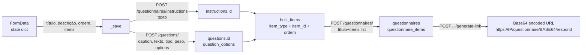
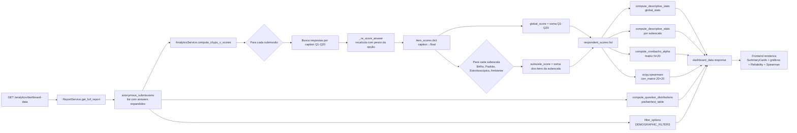

# 05 — Fluxo de Dados

## Visão Geral

```mermaid
flowchart LR
    subgraph Origem
        USR[Usuário\nBrowser]
        RESP[Respondente\nBrowser]
    end

    subgraph FrontendLayer["Frontend NiceGUI"]
        FE_FORMS[Formulários\nLogin/Signup/Criação]
        FE_ANSWER[Página de Resposta]
        FE_REPORT[Relatório/Dashboard]
        FE_EXPORT[Exportação Personalizada]
    end

    subgraph API["API FastAPI /api/v1"]
        EP_USERS[/users]
        EP_QUEST[/questionnaires]
        EP_QUESTIONS[/questions]
        EP_RESPONSES[/responses]
        EP_REPORTS[/reports]
        EP_ANALYTICS[/analytics]
    end

    subgraph Services["Backend Services"]
        SVC_USER[UserService]
        SVC_QUEST[QuestionnaireService]
        SVC_QUESTION[QuestionService]
        SVC_RESP[ResponseService]
        SVC_REPORT[ReportService]
        SVC_ANALYTICS[AnalyticsService]
    end

    subgraph DB["PostgreSQL"]
        T_USERS[(users)]
        T_QUESTIONNAIRES[(questionnaires)]
        T_ITEMS[(questionnaire_items)]
        T_QUESTIONS[(questions)]
        T_OPTIONS[(question_options)]
        T_INSTRUCTIONS[(instructions)]
        T_SUBMISSIONS[(questionnaire_submissions)]
        T_ANSWERS[(answers)]
    end

    USR --> FE_FORMS
    RESP --> FE_ANSWER
    USR --> FE_REPORT
    USR --> FE_EXPORT

    FE_FORMS -->|POST /users/| EP_USERS
    FE_FORMS -->|POST /users/login| EP_USERS
    FE_FORMS -->|POST /questions/| EP_QUESTIONS
    FE_FORMS -->|POST /questionnaires/instructions| EP_QUEST
    FE_FORMS -->|POST PUT /questionnaires/| EP_QUEST
    FE_ANSWER -->|GET /questionnaires/id/respond| EP_QUEST
    FE_ANSWER -->|POST /responses/submit| EP_RESPONSES
    FE_REPORT -->|GET /analytics/dashboard-data| EP_ANALYTICS
    FE_REPORT -->|POST /analytics/filtered-analytics| EP_ANALYTICS
    FE_REPORT -->|POST /analytics/crosstab| EP_ANALYTICS
    FE_EXPORT -->|POST /reports/custom-export| EP_REPORTS
    FE_EXPORT -->|GET /reports/export| EP_REPORTS

    EP_USERS --> SVC_USER
    EP_QUEST --> SVC_QUEST
    EP_QUESTIONS --> SVC_QUESTION
    EP_RESPONSES --> SVC_RESP
    EP_REPORTS --> SVC_REPORT
    EP_ANALYTICS --> SVC_ANALYTICS
    EP_ANALYTICS --> SVC_REPORT

    SVC_USER --> T_USERS
    SVC_QUEST --> T_QUESTIONNAIRES
    SVC_QUEST --> T_ITEMS
    SVC_QUEST --> T_QUESTIONS
    SVC_QUEST --> T_OPTIONS
    SVC_QUEST --> T_INSTRUCTIONS
    SVC_QUESTION --> T_QUESTIONS
    SVC_QUESTION --> T_OPTIONS
    SVC_RESP --> T_SUBMISSIONS
    SVC_RESP --> T_ANSWERS
    SVC_RESP --> T_QUESTIONS
    SVC_RESP --> T_OPTIONS
    SVC_REPORT --> T_SUBMISSIONS
    SVC_REPORT --> T_ANSWERS
    SVC_REPORT --> T_QUESTIONS
    SVC_REPORT --> T_OPTIONS
    SVC_REPORT --> T_ITEMS
    SVC_ANALYTICS -.->|usa dados do ReportService| SVC_REPORT
```

---

## Fluxo de Dados: Criação de Questionário



---

## Fluxo de Dados: Submissão de Resposta

```mermaid
flowchart LR
    A[Respondente\nanswers dict] -->|questionnaire_id + answers list| B[POST /responses/submit]
    B --> C[validate_submission\nverifica obrigatórias, tipos, opções]
    C -->|is_valid=False| D[JSONResponse 400\nerrors list]
    C -->|is_valid=True| E[submit_questionnaire_response]
    E --> F[Cria QuestionnaireSubmission\ntotal_score=0]
    F --> G{Para cada answer}
    G --> H[calculate_answer_score\nfree_text=0, single=peso, multiple=parcial]
    H --> I[Cria Answer\nsubmission_id + question_id + selected_options + text_response + score]
    I --> J[Acumula total_score]
    J --> K{Questões free_text\nopcionais não respondidas}
    K --> L[Cria Answer\ntext_response=N/A, score=0]
    L --> M[Update QuestionnaireSubmission.total_score]
    M --> N[JSONResponse 200\nid + total_score + answers_count]
```



---

## Fluxo de Dados: Relatório Analítico CHYPS-V



---

## Transformações de Dados por Tipo

| Dado | Origem | Transformação | Destino |
|---|---|---|---|
| Senha do usuário | Texto puro | bcrypt hash (passlib) | `users.password_hash` |
| ID do questionário | `int` | Base64 URL-safe sem padding | URL pública do link |
| Resposta text_response | Texto digitado | Strip whitespace, N/A se vazio+opcional | `answers.text_response` |
| Opções selecionadas | `[int]` | Validação existência, dedup | `answers.selected_options` (JSON) |
| Score por resposta | Opções + pesos | Regra single/multiple | `answers.score` |
| Total score | `[float]` scores | Soma | `questionnaire_submissions.total_score` |
| Item score CHYPS | `selected_options` + `option.weight` | Soma de pesos | `float` por item Q1-Q20 |
| Dados de exportação | Submissions+Answers | Wide-format (1 col por questão) | CSV/XLSX/JSON bytes |
| Distribuição de questão | `option_details` dict | Contagem → percentagem | `chart_type`, `labels`, `counts`, `percentages` |
| Alpha de Cronbach | Matriz N×k | Fórmula α | `float` |
| Correlação Spearman | Matriz N×k | `scipy.stats.spearmanr` | Matriz k×k + p-values |
| Qui-quadrado | Tabela contingência | `scipy.stats.chi2_contingency` | χ², p, dof |
| Texto do termo | HTML ou texto puro | Detecção de tags → sanitização condicional | HTML renderizado |

---

## Estrutura do Objeto `anonymous_submissions` (Formato Central)

Este objeto é produzido por `ReportService.get_full_report` e consumido por `AnalyticsService`, endpoints de analytics e o frontend.

```
[
  {
    "submission_id": int,
    "total_score": float,
    "submitted_at": "ISO8601",
    "answers": [
      {
        "id": int,
        "question_id": int,
        "question_text": str,        # title || text
        "question_title": str|null,
        "question_body": str|null,
        "question_type": "single"|"multiple"|"free_text",
        "caption": str|null,         # e.g. "Q1", "T1", "GENDER"
        "selected_options": [int],
        "selected_option_texts": [str],
        "text_response": str|null,
        "score": float,
        "question_weight": float
      }
    ]
  }
]
```
