# 06 — Dependências de Importação

## Backend: Grafo de Dependências

```mermaid
graph TD
    subgraph entry["Entrada"]
        MAIN[app/main.py]
    end

    subgraph api["API Layer"]
        API_V1[api/v1/api.py]
        EP_USERS[endpoints/users.py]
        EP_QUESTIONS[endpoints/questions.py]
        EP_QUESTIONNAIRES[endpoints/questionnaires.py]
        EP_RESPONSES[endpoints/responses.py]
        EP_REPORTS[endpoints/reports.py]
        EP_ANALYTICS[endpoints/analytics.py]
    end

    subgraph infra["Infraestrutura"]
        DB[database.py]
        CFG[config.py]
        DEPS[dependencies.py]
    end

    subgraph services["Services"]
        SVC_USER[services/user_service.py]
        SVC_QUEST[services/questionnaire_service.py]
        SVC_QUESTION[services/question_service.py]
        SVC_RESP[services/response_service.py]
        SVC_REPORT[services/report_service.py]
        SVC_ANALYTICS[services/analytics_service.py]
        CHYPS[services/chyps_config.py]
    end

    subgraph models["Models"]
        MOD_INIT[models/__init__.py]
        MOD_USER[models/user.py]
        MOD_QUEST[models/questionnaire.py]
        MOD_QUESTION[models/question.py]
        MOD_INSTR[models/instruction.py]
        MOD_RESP[models/response.py]
    end

    subgraph schemas["Schemas"]
        SCH_USER[schemas/user.py]
        SCH_QUEST[schemas/questionnaire.py]
        SCH_QUESTION[schemas/question.py]
        SCH_INSTR[schemas/instruction.py]
        SCH_RESP[schemas/response.py]
        SCH_ANALYTICS[schemas/analytics.py]
    end

    subgraph utils["Utils"]
        CRYPTO[utils/crypto.py]
    end

    MAIN --> API_V1
    MAIN --> DB
    MAIN --> MOD_INIT

    API_V1 --> EP_USERS
    API_V1 --> EP_QUESTIONS
    API_V1 --> EP_QUESTIONNAIRES
    API_V1 --> EP_RESPONSES
    API_V1 --> EP_REPORTS
    API_V1 --> EP_ANALYTICS

    EP_USERS --> DEPS
    EP_USERS --> SCH_USER
    EP_QUESTIONS --> DEPS
    EP_QUESTIONS --> SCH_QUESTION
    EP_QUESTIONNAIRES --> DEPS
    EP_QUESTIONNAIRES --> SCH_QUEST
    EP_QUESTIONNAIRES --> SCH_INSTR
    EP_RESPONSES --> DEPS
    EP_RESPONSES --> SCH_RESP
    EP_REPORTS --> DEPS
    EP_REPORTS --> SCH_ANALYTICS
    EP_ANALYTICS --> DEPS
    EP_ANALYTICS --> SCH_ANALYTICS
    EP_ANALYTICS --> MOD_USER
    EP_ANALYTICS --> CHYPS

    DEPS --> SVC_USER
    DEPS --> SVC_QUEST
    DEPS --> SVC_QUESTION
    DEPS --> SVC_RESP
    DEPS --> SVC_REPORT
    DEPS --> SVC_ANALYTICS
    DEPS --> DB

    SVC_USER --> MOD_USER
    SVC_USER --> SCH_USER
    SVC_QUEST --> MOD_INIT
    SVC_QUEST --> SCH_QUEST
    SVC_QUEST --> SCH_QUESTION
    SVC_QUEST --> SCH_INSTR
    SVC_QUEST --> CRYPTO
    SVC_QUEST --> CFG
    SVC_QUESTION --> MOD_QUESTION
    SVC_QUESTION --> SCH_QUESTION
    SVC_RESP --> MOD_INIT
    SVC_RESP --> SCH_RESP
    SVC_REPORT --> MOD_INIT
    SVC_ANALYTICS --> CHYPS

    DB --> CFG

    MOD_INIT --> MOD_USER
    MOD_INIT --> MOD_QUEST
    MOD_INIT --> MOD_QUESTION
    MOD_INIT --> MOD_INSTR
    MOD_INIT --> MOD_RESP
    MOD_INIT --> DB

    MOD_USER --> DB
    MOD_QUEST --> DB
    MOD_QUESTION --> DB
    MOD_INSTR --> DB
    MOD_RESP --> DB

    SCH_USER --> MOD_USER
    SCH_QUEST --> MOD_QUEST
    SCH_QUEST --> SCH_QUESTION
    SCH_QUEST --> SCH_INSTR
    SCH_QUESTION --> MOD_QUESTION
```

---

## Frontend: Grafo de Dependências

```mermaid
graph TD
    subgraph entry_fe["Entrada"]
        APP[app.py]
        ROUTER[router.py]
    end

    subgraph pages_fe["Pages"]
        PG_AUTH[pages/auth_page.py]
        PG_DASH[pages/dashboard.py]
        PG_LIST[pages/questionnaire_list_page.py]
        PG_CREATE[pages/questionnaire_create_page.py]
        PG_ANSWER[pages/questionnaire_answer_page.py]
        PG_REPORTS[pages/reports_page.py]
        PG_DETAILED[pages/report_detailed.py]
        PG_ANALYTICS[pages/report_analytics.py]
        PG_EXPORT[pages/custom_export_page.py]
    end

    subgraph comps_fe["Components"]
        COMP_LOGIN[components/auth/login_form.py]
        COMP_SIGNUP[components/auth/signup_form.py]
        COMP_MODAL[components/auth/auth_modal.py]
        COMP_ITEM_ED[components/questionnaire/question_item_editor.py]
        COMP_SORT[components/questionnaire/sortable_column.py]
        COMP_SUMMARY[components/dashboard/summary_cards.py]
        COMP_PIE[components/dashboard/pie_chart_card.py]
        COMP_BAR[components/dashboard/bar_chart_card.py]
        COMP_SUBSCALE[components/dashboard/subscale_section.py]
        COMP_RELI[components/dashboard/reliability_card.py]
        COMP_CROSS[components/dashboard/crosstab_tool.py]
        COMP_FILTER[components/dashboard/filter_sidebar.py]
        COMP_EXPORT_BTN[components/dashboard/export_buttons.py]
        COMP_PLOTLY[components/shared/plotly_config.py]
    end

    subgraph svcs_fe["Services"]
        SVC_API[services/api_client.py]
        SVC_USER_FE[services/user_service.py]
        SVC_QUEST_FE[services/questionnaire_service.py]
        SVC_QUESTION_FE[services/question_service.py]
        SVC_INSTR_FE[services/instruction_service.py]
        SVC_RESP_FE[services/response_service.py]
        SVC_REPORT_FE[services/report_service.py]
        SVC_ANALYTICS_FE[services/analytics_service.py]
        SVC_CUSTOM_EXP[services/custom_export_service.py]
    end

    subgraph utils_fe["Utils"]
        SESS[utils/session_manager.py]
        VALID[utils/validators.py]
        CFG_FE[config.py]
    end

    APP --> PG_AUTH
    APP --> PG_DASH
    APP --> SESS
    APP --> ROUTER

    ROUTER --> PG_ANSWER

    PG_AUTH --> COMP_LOGIN
    PG_AUTH --> COMP_SIGNUP

    PG_DASH --> PG_LIST
    PG_DASH --> PG_REPORTS
    PG_DASH --> SESS
    PG_DASH --> ROUTER

    PG_LIST --> SVC_QUEST_FE
    PG_LIST --> SESS
    PG_LIST --> PG_CREATE
    PG_LIST --> ROUTER

    PG_CREATE --> SESS
    PG_CREATE --> SVC_INSTR_FE
    PG_CREATE --> SVC_QUESTION_FE
    PG_CREATE --> SVC_QUEST_FE
    PG_CREATE --> COMP_ITEM_ED
    PG_CREATE --> COMP_SORT
    PG_CREATE --> SVC_API

    PG_ANSWER --> SVC_QUEST_FE
    PG_ANSWER --> SVC_RESP_FE
    PG_ANSWER --> SESS
    PG_ANSWER --> COMP_MODAL

    PG_REPORTS --> SVC_QUEST_FE
    PG_REPORTS --> SVC_REPORT_FE
    PG_REPORTS --> SESS
    PG_REPORTS --> PG_DETAILED
    PG_REPORTS --> PG_ANALYTICS
    PG_REPORTS --> PG_EXPORT
    PG_REPORTS --> ROUTER

    PG_DETAILED --> SVC_REPORT_FE
    PG_DETAILED --> SVC_ANALYTICS_FE
    PG_DETAILED --> COMP_SUMMARY
    PG_DETAILED --> COMP_PIE
    PG_DETAILED --> COMP_BAR
    PG_DETAILED --> COMP_SUBSCALE
    PG_DETAILED --> COMP_RELI
    PG_DETAILED --> COMP_CROSS
    PG_DETAILED --> COMP_FILTER
    PG_DETAILED --> COMP_EXPORT_BTN
    PG_DETAILED --> COMP_PLOTLY

    PG_ANALYTICS --> SVC_REPORT_FE

    PG_EXPORT --> SVC_QUEST_FE
    PG_EXPORT --> SVC_REPORT_FE
    PG_EXPORT --> SVC_CUSTOM_EXP
    PG_EXPORT --> SESS

    COMP_LOGIN --> SVC_USER_FE
    COMP_LOGIN --> VALID
    COMP_LOGIN --> SESS

    COMP_SIGNUP --> SVC_USER_FE
    COMP_SIGNUP --> VALID

    COMP_MODAL --> COMP_LOGIN
    COMP_MODAL --> COMP_SIGNUP
    COMP_MODAL --> SESS

    COMP_ITEM_ED --> COMP_SORT

    COMP_PIE --> COMP_PLOTLY
    COMP_BAR --> COMP_PLOTLY
    COMP_SUBSCALE --> COMP_PLOTLY
    COMP_CROSS -.->|plotly direto| COMP_PLOTLY
    COMP_EXPORT_BTN --> SVC_REPORT_FE

    SVC_USER_FE --> SVC_API
    SVC_QUEST_FE --> SVC_API
    SVC_QUESTION_FE --> SVC_API
    SVC_INSTR_FE --> SVC_API
    SVC_RESP_FE --> SVC_API
    SVC_ANALYTICS_FE --> SVC_API
    SVC_REPORT_FE --> SVC_API
    SVC_REPORT_FE --> CFG_FE

    SVC_API --> CFG_FE
```

---

## Dependências Externas por Camada

### Backend (requirements.txt)

| Pacote | Versão | Uso |
|---|---|---|
| fastapi | 0.104.1 | Framework web REST |
| uvicorn[standard] | 0.24.0 | Servidor ASGI |
| sqlalchemy | 2.0.23 | ORM |
| alembic | 1.12.1 | Migrações de banco |
| psycopg2-binary | 2.9.9 | Driver PostgreSQL |
| pydantic | 2.5.0 | Validação de schemas |
| pydantic-settings | 2.1.0 | Configuração via env |
| bcrypt | 4.0.1 | Hashing de senhas |
| passlib[bcrypt] | 1.7.4 | Contexto criptográfico |
| python-multipart | 0.0.6 | Formulários HTTP |
| email-validator | latest | Validação de email Pydantic |
| numpy | >=1.26.0 | Arrays numéricos para analytics |
| scipy | >=1.11.0 | Stats: mode, spearmanr, chi2_contingency |
| pandas | >=2.1.0 | Listado em requirements, não importado explicitamente no código analisado |
| openpyxl | (implícita) | Geração de .xlsx (importado localmente em reports.py) |

### Frontend (requirements.txt — não lido completamente, inferido do código)

| Pacote | Uso |
|---|---|
| nicegui | Framework UI web Python |
| requests | Cliente HTTP para chamadas à API |
| plotly | Gráficos interativos |
| numpy | Usado em plotly_config (histograma manual) |
| openpyxl | Geração de .xlsx local |
