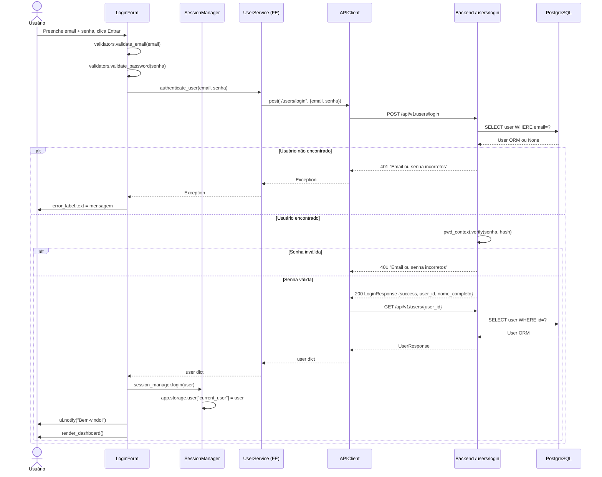
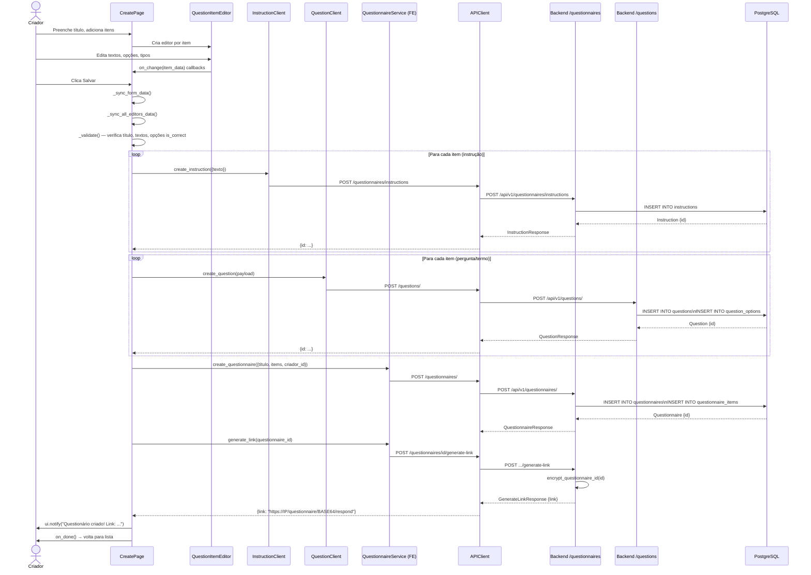
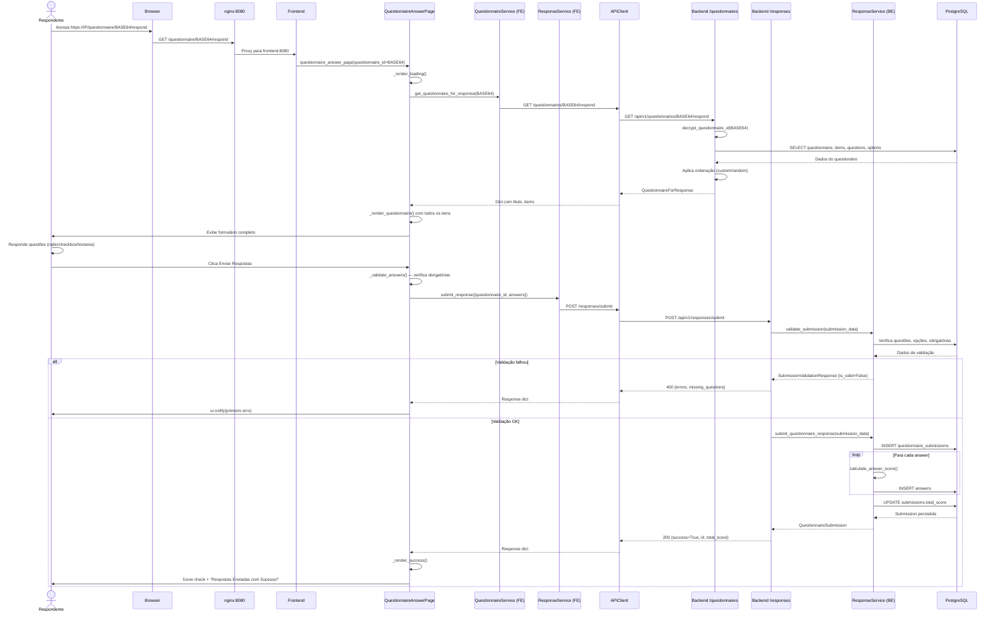
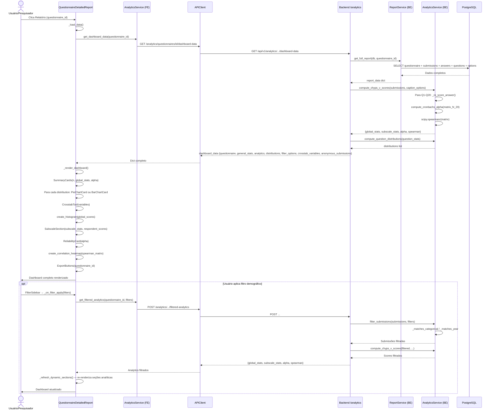

# 07 — Diagramas de Sequência

## Sequência 1: Login de Usuário

---

## Sequência 2: Criação de Questionário

---

## Sequência 3: Resposta a Questionário

---

## Sequência 4: Visualização do Dashboard Analítico

