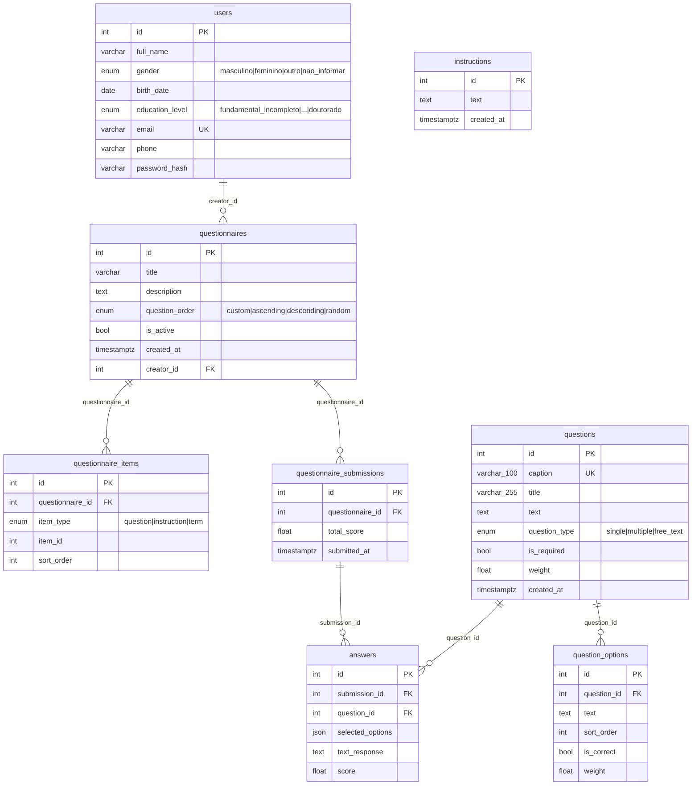

# 08 — Entidades e Estruturas de Dados

## Diagrama ER (banco de dados)



---

## Notas sobre Relacionamentos Polimórficos

`questionnaire_items.item_id` é uma **foreign key polimórfica**:
- Quando `item_type = 'question'` ou `'term'`: aponta para `questions.id`
- Quando `item_type = 'instruction'`: aponta para `instructions.id`

O banco não tem restrição de FK aqui — a integridade é garantida pela aplicação.

---

## Estruturas JSON em Tempo de Execução

### Schema Pydantic: `SubmissionCreate`

```json
{
  "questionnaire_id": 42,
  "answers": [
    {
      "question_id": 1,
      "selected_options": [3, 7],
      "text_response": null
    },
    {
      "question_id": 2,
      "selected_options": [],
      "text_response": "Resposta em texto aqui"
    }
  ]
}
```

### Schema Pydantic: `QuestionnaireCreate`

```json
{
  "titulo": "Escala CHYPS-V",
  "descricao": "Avaliação de sensibilidade visual",
  "question_order": "custom",
  "criador_id": 1,
  "items": [
    {"item_type": "instruction", "item_id": 5, "ordem": 1},
    {"item_type": "question",    "item_id": 12, "ordem": 2},
    {"item_type": "term",        "item_id": 13, "ordem": 3}
  ]
}
```

### Schema: `QuestionForResponse` (retorno para respondente)

```json
{
  "id": 12,
  "caption": "Q1",
  "titulo": "Título exibido",
  "texto": "Texto da pergunta...",
  "tipo": "single",
  "obrigatoria": true,
  "peso": 1.0,
  "options": [
    {"id": 101, "texto": "Quase Nunca", "ordem": 1, "is_correct": false, "peso": 0.0},
    {"id": 102, "texto": "Ocasionalmente", "ordem": 2, "is_correct": false, "peso": 1.0},
    {"id": 103, "texto": "Frequentemente", "ordem": 3, "is_correct": false, "peso": 2.0},
    {"id": 104, "texto": "Quase Sempre", "ordem": 4, "is_correct": false, "peso": 3.0}
  ]
}
```

### Objeto `anonymous_submissions` (central para analytics)

```json
[
  {
    "submission_id": 10,
    "total_score": 35.5,
    "submitted_at": "2025-05-01T14:30:00Z",
    "answers": [
      {
        "id": 100,
        "question_id": 12,
        "question_text": "Texto da pergunta Q1",
        "question_title": "Título Q1",
        "question_body": "Corpo da pergunta",
        "question_type": "single",
        "caption": "Q1",
        "selected_options": [102],
        "selected_option_texts": ["Ocasionalmente"],
        "text_response": null,
        "score": 1.0,
        "question_weight": 1.0
      }
    ]
  }
]
```

### Resposta `get_full_report`

```json
{
  "questionnaire": {
    "id": 42,
    "title": "Escala CHYPS-V",
    "description": "...",
    "question_order": "custom",
    "created_by": 1,
    "created_at": "2025-01-10T10:00:00",
    "active": true
  },
  "general_stats": {
    "total_submissions": 50,
    "average_score": 28.4,
    "total_correct": 620,
    "total_incorrect": 380,
    "completion_rate": 100.0
  },
  "question_statistics": [
    {
      "question_id": 12,
      "question_text": "Q1: ...",
      "question_type": "single",
      "total_answers": 50,
      "correct_answers": 18,
      "accuracy_percentage": 36.0,
      "error_rate": 64.0,
      "weight": 1.0,
      "avg_score": 0.36,
      "option_details": {
        "101": {"text": "Quase Nunca", "count": 12, "percentage": 24.0, "is_correct": false, "weight": 0.0}
      }
    }
  ],
  "anonymous_submissions": []
}
```

### Resposta `compute_chyps_v_scores`

```json
{
  "respondent_scores": [
    {
      "submission_id": 10,
      "global_score": 35.5,
      "subscale_scores": {
        "Brilho": 12.0,
        "Padrão": 10.5,
        "Estroboscópico": 8.0,
        "Ambiente Visual Intenso": 5.0
      },
      "item_scores": {"Q1": 2.0, "Q2": 1.0, "...": "..."}
    }
  ],
  "global_stats": {
    "mean": 28.4, "sd": 8.2, "mode": 30.0,
    "median": 29.0, "iqr": 12.5, "min": 5.0, "max": 55.0, "n": 50
  },
  "subscale_stats": {
    "Brilho": {
      "mean": 9.1, "sd": 3.2, "mode": 8.0, "median": 9.0,
      "iqr": 4.0, "min": 0.0, "max": 18.0, "n": 50,
      "items": ["Q3","Q7","Q9","Q11","Q13","Q19"],
      "label_en": "Brightness"
    }
  },
  "cronbachs_alpha": 0.8924,
  "spearman_correlation": {
    "matrix": [[1.0, 0.75, "..."], [0.75, 1.0, "..."]],
    "p_values": [[0.0, 0.0001, "..."], ["..."]],
    "labels": ["Q1","Q2","...","Q20"]
  }
}
```

### Resposta `custom_export`

```json
{
  "column_keys": ["submission_id", "submitted_at", "total_score", "q_12", "q_13"],
  "column_labels": {
    "submission_id": "ID da Submissão",
    "submitted_at": "Data de Envio",
    "total_score": "Pontuação Total",
    "q_12": "Q1: Texto da pergunta...",
    "q_13": "Q2: Outro texto..."
  },
  "rows": [
    {
      "submission_id": 10,
      "submitted_at": "2025-05-01T14:30:00",
      "total_score": 35.5,
      "q_12": "Ocasionalmente",
      "q_13": "Frequentemente"
    }
  ],
  "total": 50
}
```

---

## Configuração CHYPS-V (chyps_config.py)

| Elemento | Valor |
|---|---|
| Itens da escala | Q1, Q2, ..., Q20 |
| Score range global | 0 – 60 |
| Escala Likert | 0=Quase Nunca, 1=Ocasionalmente, 2=Frequentemente, 3=Quase Sempre |
| Subescala Brilho | Q3, Q7, Q9, Q11, Q13, Q19 (6 itens) |
| Subescala Padrão | Q1, Q5, Q12, Q14, Q15, Q20 (6 itens) |
| Subescala Estroboscópico | Q2, Q6, Q10, Q16, Q18 (5 itens) |
| Subescala Ambiente Visual Intenso | Q4, Q8, Q17 (3 itens) |
| Filtro diagnóstico | pattern: "diagnóstico prévio" |
| Filtro medicamento | pattern: "uso de medicamento psiquiátrico" |
| Filtro nascimento | pattern: "data de nascimento", type: "year" |

---

## Constante `DEMOGRAPHIC_CAPTIONS` (chyps_config.py)

Mapeia nomes de campos demográficos internos para os captions usados nas colunas do questionário:

```python
DEMOGRAPHIC_CAPTIONS = {
    "gender": "GENDER",
    "age": "AGE",
    "diagnosis": "DIAGNOSIS",
}
```

| Chave interna | Caption no questionário | Descrição |
|---|---|---|
| `gender` | `GENDER` | Coluna de gênero do respondente |
| `age` | `AGE` | Coluna de idade/ano de nascimento |
| `diagnosis` | `DIAGNOSIS` | Coluna de diagnóstico prévio de transtorno |
