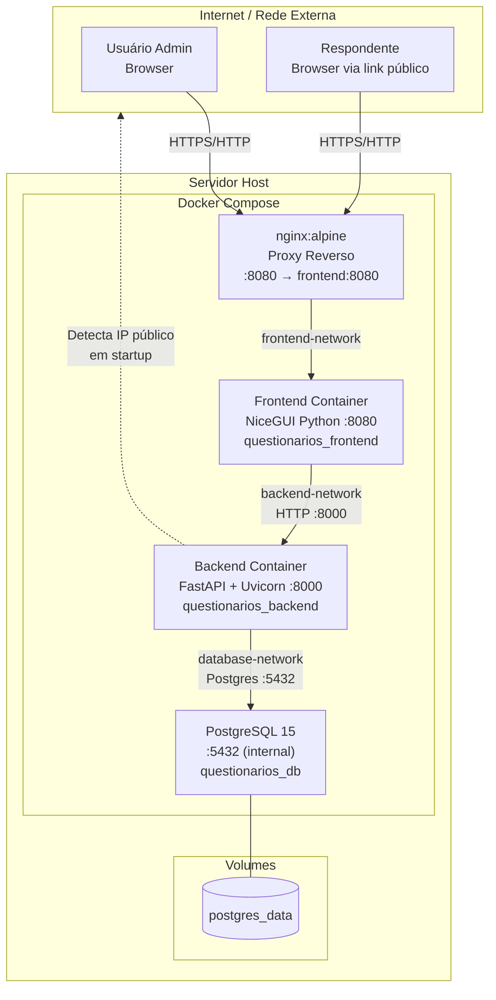

# 09 — Arquitetura do Sistema

## Nível ALTO — Visão de Implantação



**Redes Docker:**
- `frontend-network`: nginx ↔ frontend (bridge)
- `backend-network`: frontend ↔ backend (bridge)
- `database-network`: backend ↔ db (bridge, **internal=true** — sem acesso externo)

---

## Nível MÉDIO — Arquitetura de Camadas

```mermaid
flowchart TD
    subgraph FE_LAYER["Camada Apresentação (NiceGUI)"]
        subgraph FE_PAGES["Pages"]
            AUTH[Auth\nlogin/signup]
            DASH[Dashboard\nnavegação]
            Q_LIST[Lista\nQuestionários]
            Q_CREATE[Editor\nQuestionários]
            Q_ANSWER[Resposta\npública]
            REPORTS[Relatórios\nlista]
            REPORT_DET[Relatório\nDetalhado]
            CUSTOM_EXP[Exportação\nPersonalizada]
        end

        subgraph FE_COMPS["Components"]
            AUTH_COMP[Auth Forms\nlogin/signup/modal]
            ITEM_ED[QuestionItemEditor\nEditor de item]
            SORT_COL[SortableColumn\ndrag-and-drop]
            DASH_COMPS[Dashboard Components\ncharts/filters/crosstab]
            PLOTLY[Plotly Config\nfábrica de gráficos]
        end

        subgraph FE_SVCS["Frontend Services"]
            API_CLI[APIClient\nHTTP requests]
            FE_USER_SVC[UserService]
            FE_QUEST_SVC[QuestionnaireService]
            FE_Q_SVC[QuestionService]
            FE_RESP_SVC[ResponseService]
            FE_RPT_SVC[ReportService]
            FE_ANA_SVC[AnalyticsService]
            FE_EXP_SVC[CustomExportService\nconversão local]
        end

        FE_SVCS_UTILS[Utils\nsession_manager / validators / config]
    end

    subgraph BE_LAYER["Camada API (FastAPI)"]
        subgraph ENDPOINTS["Endpoints REST"]
            EP_U[/users]
            EP_Q[/questions]
            EP_QN[/questionnaires]
            EP_R[/responses]
            EP_RPT[/reports]
            EP_ANA[/analytics]
        end

        DEPS[FastAPI Dependencies\ninjeção de serviços]

        subgraph BE_SVCS["Backend Services"]
            B_USR[UserService\nbcrypt + CRUD]
            B_QN[QuestionnaireService\nCRUD + links]
            B_Q[QuestionService\nCRUD perguntas]
            B_RESP[ResponseService\nvalidação + scoring]
            B_RPT[ReportService\nrelatórios + export]
            B_ANA[AnalyticsService\nCHYPS + stats]
            B_CHYPS[chyps_config\nconstantes]
        end

        BE_INFRA[Infraestrutura\ndatabase / config / crypto / dependencies]
    end

    subgraph DB_LAYER["Camada Dados (PostgreSQL)"]
        MODELS[ORM Models\nSQLAlchemy]
        SCHEMAS[Schemas\nPydantic v2]
        TABLES[Tabelas\n8 tabelas + migrações Alembic]
    end

    AUTH --> AUTH_COMP
    Q_CREATE --> ITEM_ED
    Q_CREATE --> SORT_COL
    REPORT_DET --> DASH_COMPS
    REPORT_DET --> PLOTLY
    DASH_COMPS --> PLOTLY

    FE_PAGES --> FE_SVCS
    FE_COMPS --> FE_SVCS
    FE_PAGES --> FE_SVCS_UTILS

    API_CLI -->|HTTP/REST| ENDPOINTS
    FE_USER_SVC --> API_CLI
    FE_QUEST_SVC --> API_CLI
    FE_Q_SVC --> API_CLI
    FE_RESP_SVC --> API_CLI
    FE_RPT_SVC --> API_CLI
    FE_ANA_SVC --> API_CLI

    ENDPOINTS --> DEPS
    DEPS --> BE_SVCS

    BE_SVCS --> BE_INFRA
    BE_INFRA --> MODELS
    MODELS --> TABLES
    ENDPOINTS --> SCHEMAS
```

---

## Nível BAIXO — Detalhe dos Módulos de Análise

```mermaid
flowchart TD
    subgraph ANA_ENDPOINT["/analytics endpoint"]
        GET_DASH[GET /dashboard-data]
        POST_FILTER[POST /filtered-analytics]
        POST_CHYPS[POST /chyps-scores]
        POST_CROSS[POST /crosstab]
        GET_DIST[GET /question-distributions]
        POST_TEXT[POST /text-responses]
        GET_FILTER_OPT[GET /filter-options]
        GET_CROSS_VARS[GET /crosstab-variables]
    end

    subgraph HELPERS[Helpers (module-level)]
        BUILD_MAP[_build_caption_option_map\nquestionnaire → caption:{id,text,weight}]
        EXTRACT_VAR[_extract_variable_values\nsubmissions + variable → list]
        COMPUTE_FO[_compute_filter_options\nsubmissions → {demo_key: values}]
        GET_CROSS_V[_get_crosstab_variables\nitems → list caption+text+type]
    end

    subgraph ANA_SVC[AnalyticsService]
        COMPUTE_DESC[compute_descriptive_stats\nmean/sd/mode/median/iqr/min/max/n]
        RE_SCORE[_re_score_answer\nselected_options + option_weights → float]
        CHYPS_SCORES[compute_chyps_v_scores\nsubmissions + caption_options → full CHYPS result]
        CRONBACH[compute_cronbachs_alpha\nitem_matrix NxK → float]
        SPEARMAN[scipy.spearmanr\nmatrix NxK → corr + p_values]
        CROSSTAB[compute_crosstab\nrow_vals + col_vals → table + chi2]
        FILTER[filter_submissions\nsubmissions + filters → filtered list]
        DISTRIB[compute_question_distributions\nquestion_stats → pie/bar/text_table]
    end

    subgraph RPT_SVC[ReportService]
        FULL_RPT[get_full_report\nDB → full dict with anonymous_submissions]
        SUMMARY_RPT[get_summary_report\nDB → total/avg/max/min]
        CUSTOM_EXP[custom_export\nDB + filtros → wide-format dict]
        Q_ANALYSIS[get_question_analysis\nDB → per-question analysis]
    end

    GET_DASH --> FULL_RPT
    GET_DASH --> CHYPS_SCORES
    GET_DASH --> DISTRIB
    GET_DASH --> COMPUTE_FO
    GET_DASH --> GET_CROSS_V

    POST_FILTER --> FULL_RPT
    POST_FILTER --> FILTER
    POST_FILTER --> CHYPS_SCORES

    POST_CHYPS --> FULL_RPT
    POST_CHYPS --> FILTER
    POST_CHYPS --> BUILD_MAP
    POST_CHYPS --> CHYPS_SCORES

    POST_CROSS --> FULL_RPT
    POST_CROSS --> FILTER
    POST_CROSS --> EXTRACT_VAR
    POST_CROSS --> CROSSTAB

    GET_DIST --> FULL_RPT
    GET_DIST --> DISTRIB

    POST_TEXT --> FULL_RPT
    POST_TEXT --> FILTER

    GET_FILTER_OPT --> FULL_RPT
    GET_FILTER_OPT --> COMPUTE_FO

    CHYPS_SCORES --> RE_SCORE
    CHYPS_SCORES --> COMPUTE_DESC
    CHYPS_SCORES --> CRONBACH
    CHYPS_SCORES --> SPEARMAN
```

---

## Decisões Arquiteturais Notáveis

| Decisão | Rationale | Tradeoff |
|---|---|---|
| Frontend NiceGUI (Python) | Desenvolvimento rápido, componentes UI em Python | Não usa framework SPA; SSR via websocket; menor ecossistema |
| Backend FastAPI | Alta performance, tipagem, auto-docs | Requer uvicorn; sem JWT nativo |
| Sessão via NiceGUI storage (sem JWT) | Simplicidade | Stateful server-side; não suporta múltiplos backends |
| ID de questionário em Base64 | Ofusca IDs sequenciais em URLs públicas | Não é criptografia real; apenas ofuscação |
| Deleção em cascata manual (sem ON DELETE CASCADE) | Controle explícito da ordem | Código verboso em `delete_questionnaire`; risco de inconsistência se falhar no meio |
| `anonymous_submissions` como formato central | Ponto de encontro entre ReportService e AnalyticsService | ReportService carrega tudo em memória; potencial gargalo com grandes volumes |
| Frontend services como singletons de módulo | Simplicidade | Sem injeção de dependência; dificulta testes unitários |
| CORS `allow_origins=["*"]` | Desenvolvimento facilitado | Inseguro para produção com dados sensíveis |
| Detecção de IP público em startup | Links funcionam em qualquer rede | Latência no startup; falha silenciosa com fallback localhost |
