# Backend class model (high-level)

```mermaid
classDiagram

%% =====================
%% Enums
%% =====================
class GenderEnum {
  <<enum>>
  masculino
  feminino
  outro
  nao_informar
}

class EducationLevelEnum {
  <<enum>>
  fundamental_incompleto
  fundamental_completo
  medio_incompleto
  medio_completo
  superior_incompleto
  superior_completo
  pos_graduacao
  mestrado
  doutorado
}

class QuestionOrderEnum {
  <<enum>>
  custom
  ascending
  descending
  random
}

class ItemTypeEnum {
  <<enum>>
  question
  instruction
  term
}

class QuestionTypeEnum {
  <<enum>>
  single
  multiple
  free_text
}

%% =====================
%% SQLAlchemy Models
%% =====================
class User {
  +int id
  +str full_name
  +GenderEnum gender
  +date birth_date
  +EducationLevelEnum education_level
  +str email
  +str phone
  +str password_hash
}

class Questionnaire {
  +int id
  +str title
  +str description
  +QuestionOrderEnum question_order
  +bool is_active
  +datetime created_at
  +int creator_id
}

class QuestionnaireItem {
  +int id
  +int questionnaire_id
  +ItemTypeEnum item_type
  +int item_id
  +int sort_order
}

class Question {
  +int id
  +str caption
  +str title
  +str text
  +QuestionTypeEnum question_type
  +bool is_required
  +float weight
  +datetime created_at
}

class QuestionOption {
  +int id
  +int question_id
  +str text
  +int sort_order
  +bool is_correct
  +float weight
}

class Instruction {
  +int id
  +str text
  +datetime created_at
}

class QuestionnaireSubmission {
  +int id
  +int questionnaire_id
  +float total_score
  +datetime submitted_at
}

class Answer {
  +int id
  +int submission_id
  +int question_id
  +list selected_options
  +str text_response
  +float score
}

%% Model relationships
User "1" --> "0..*" Questionnaire : created_questionnaires
Questionnaire "1" --> "0..*" QuestionnaireItem : items
Questionnaire "1" --> "0..*" QuestionnaireSubmission : submissions
QuestionnaireSubmission "1" --> "0..*" Answer : answers
Question "1" --> "0..*" QuestionOption : options
Question "1" --> "0..*" Answer : answers

%% Polymorphic association (logical)
QuestionnaireItem ..> Question : item_id when question/term
QuestionnaireItem ..> Instruction : item_id when instruction

%% =====================
%% Pydantic Schemas (DTOs)
%% =====================
class UserCreate {
  +str nome_completo
  +GenderEnum genero
  +date nascimento
  +EducationLevelEnum escolaridade
  +str email
  +str telefone
  +str senha
}
class UserUpdate {
  +str? nome_completo
  +GenderEnum? genero
  +date? nascimento
  +EducationLevelEnum? escolaridade
  +str? email
  +str? telefone
}
class UserResponse {
  +int id
  +str nome_completo
  +GenderEnum genero
  +date nascimento
  +EducationLevelEnum escolaridade
  +str email
  +str telefone
}
class LoginRequest {
  +str email
  +str senha
}
class LoginResponse {
  +bool success
  +str message
  +int? user_id
  +str? nome_completo
}

class QuestionOptionCreate {
  +str texto
  +int ordem
  +bool is_correct
  +float peso
}
class QuestionCreate {
  +str? caption
  +str? titulo
  +str texto
  +QuestionTypeEnum tipo
  +bool obrigatoria
  +float peso
  +QuestionOptionCreate[] options
}
class QuestionOptionResponse {
  +int id
  +str texto
  +int ordem
  +bool is_correct
  +float peso
}
class QuestionForResponse {
  +int id
  +str? caption
  +str? titulo
  +str texto
  +QuestionTypeEnum tipo
  +bool obrigatoria
  +float peso
  +QuestionOptionResponse[] options
}

class InstructionCreate {
  +str texto
}
class InstructionResponse {
  +int id
  +str texto
}

class QuestionnaireItemCreate {
  +ItemTypeEnum item_type
  +int item_id
  +int ordem
}
class QuestionnaireCreate {
  +str titulo
  +str? descricao
  +QuestionOrderEnum question_order
  +QuestionnaireItemCreate[] items
  +int criador_id
}
class QuestionnaireItemForResponse {
  +ItemTypeEnum tipo
  +int ordem
  +QuestionForResponse|InstructionResponse content
}
class QuestionnaireForResponse {
  +int id
  +str titulo
  +str? descricao
  +str question_order
  +QuestionnaireItemForResponse[] items
}
class GenerateLinkResponse {
  +int questionnaire_id
  +str link
}

class AnswerCreate {
  +int question_id
  +int[] selected_options
  +str? text_response
}
class SubmissionCreate {
  +int questionnaire_id
  +AnswerCreate[] answers
}
class SubmissionValidationResponse {
  +bool is_valid
  +str message
  +int total_questions
  +int answered_questions
  +int[] missing_questions
  +str[]? errors
  +str[]? warnings
}

class FilterParams {
  +str[]? diagnosis
  +str[]? medication
  +dict? birth_year
  +to_filter_dict() dict
}
class CrosstabRequest {
  +str row_variable
  +str col_variable
  +FilterParams? filters
}
class TextResponseQuery {
  +int question_id
  +str? search
  +int page
  +int page_size
  +FilterParams? filters
}

%% DTO relations (usage)
UserCreate ..> GenderEnum
UserCreate ..> EducationLevelEnum
UserResponse ..> User
QuestionCreate ..> QuestionTypeEnum
QuestionForResponse ..> Question
QuestionnaireCreate ..> Questionnaire
SubmissionCreate ..> QuestionnaireSubmission

%% =====================
%% Services
%% =====================
class UserService {
  +create_user(db, UserCreate) User
  +get_user_by_id(db, int) User
  +update_user(db, int, UserUpdate) User
  +delete_user(db, int) bool
  +list_users(db, int, int) User[]
  +login_user(db, str, str) LoginResponse
}

class QuestionService {
  +create_question(db, QuestionCreate) Question
  +get_question_by_id(db, int) Question
  +get_question_by_caption(db, str) Question
  +add_option_to_question(db, int, QuestionOptionCreate) QuestionOption
  +list_questions(db, int, int) Question[]
  +update_question(db, int, dict) Question
  +delete_question(db, int) bool
}

class QuestionnaireService {
  +create_instruction(db, InstructionCreate) Instruction
  +create_questionnaire(db, QuestionnaireCreate) Questionnaire
  +generate_questionnaire_link(db, int) GenerateLinkResponse
  +get_questionnaire_for_response(db, str) QuestionnaireForResponse
  +list_questionnaires(db, int, int) Questionnaire[]
  +list_questionnaires_by_creator(db, int) Questionnaire[]
  +update_questionnaire(db, int, QuestionnaireCreate) Questionnaire
  +delete_questionnaire(db, int) bool
}

class ResponseService {
  +validate_submission(db, SubmissionCreate) SubmissionValidationResponse
  +submit_questionnaire_response(db, SubmissionCreate) QuestionnaireSubmission
  +get_submission_by_id(db, int) QuestionnaireSubmission
  +delete_submission(db, int) bool
  +list_submissions_by_questionnaire(db, int) QuestionnaireSubmission[]
  +get_answers_by_question(db, int, int) Answer[]
}

class ReportService {
  +get_full_report(db, int) dict
}

class AnalyticsService {
  +compute_chyps_v_scores(submissions, caption_to_options) dict
  +compute_cronbachs_alpha(item_matrix) float
  +filter_submissions(submissions, filters) list
  +compute_crosstab(row_values, col_values) dict
}

%% Service dependencies
UserService ..> User
UserService ..> UserCreate
UserService ..> UserUpdate
UserService ..> LoginResponse

QuestionService ..> Question
QuestionService ..> QuestionOption
QuestionService ..> QuestionCreate
QuestionService ..> QuestionOptionCreate

QuestionnaireService ..> Questionnaire
QuestionnaireService ..> QuestionnaireItem
QuestionnaireService ..> Question
QuestionnaireService ..> QuestionOption
QuestionnaireService ..> Instruction

ResponseService ..> QuestionnaireSubmission
ResponseService ..> Answer
ResponseService ..> Question
ResponseService ..> QuestionOption

ReportService ..> Questionnaire
ReportService ..> QuestionnaireSubmission
ReportService ..> Answer
ReportService ..> Question
ReportService ..> QuestionOption
ReportService ..> QuestionnaireItem

AnalyticsService ..> QuestionnaireSubmission
AnalyticsService ..> Answer
```

Notes:
- This is a “structural” view of the backend: models (ORM), schemas (DTOs), and services.
- Routers (FastAPI endpoints) are function-based, so they’re not shown as classes; they depend on the service classes via `app/dependencies.py`.
