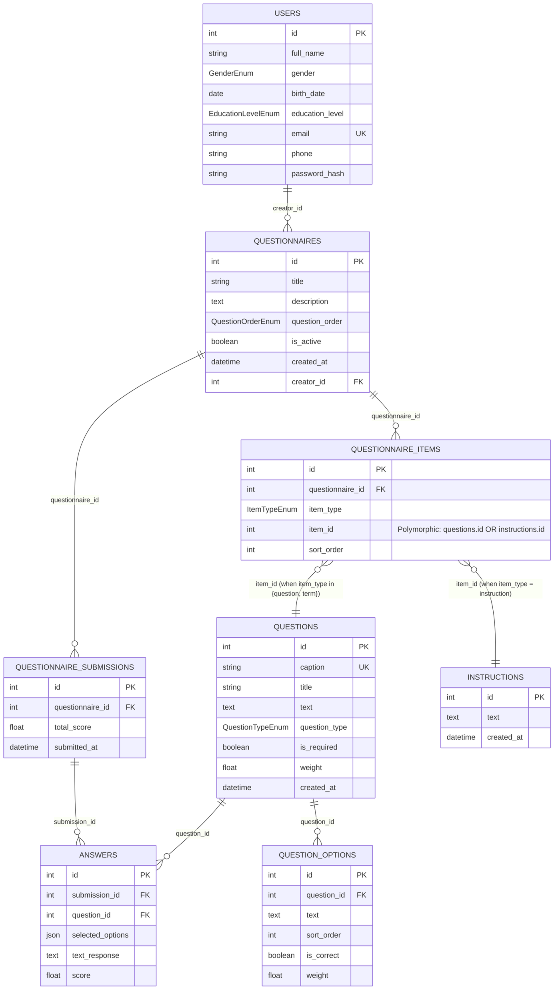

# Database ERD (backend)

Notes:
- `questionnaire_items.item_id` is polymorphic (points to `questions.id` or `instructions.id` depending on `item_type`).
- Some `term` items are stored as `Question` rows in your current DB (based on existing data), even though the enum allows `instruction`.
