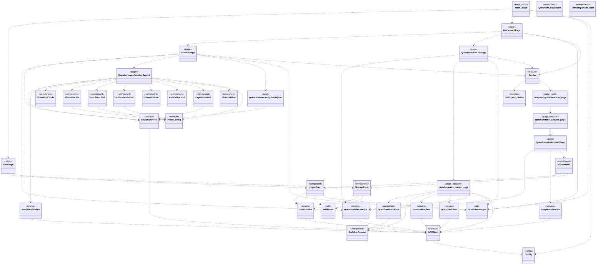

# Frontend class model (high-level)

Notes:
- This diagram is a high-level view of the frontend modules, pages, and UI components.
- The page entry point is defined in app.py using NiceGUI and routes in router.py.
- questionnaire_create_page and questionnaire_answer_page are page-level functions rather than classes.
