# Frontend component diagram (high-level)

```mermaid
flowchart TD
    App[app.py main_page] --> AuthPage[AuthPage]
    App --> DashboardPage[DashboardPage]
    App --> SessionManager[SessionManager]
    App --> Config[Config]

    Router[router.py] --> ClearAndRender[clear_and_render]
    Router --> RespondPage[respond_questionnaire_page]
    RespondPage --> QuestionnaireAnswerFn[questionnaire_answer_page]
    QuestionnaireAnswerFn --> QuestionnaireAnswerPage[QuestionnaireAnswerPage]

    DashboardPage --> ReportsPage[ReportsPage]
    DashboardPage --> QuestionnaireListPage[QuestionnaireListPage]
    DashboardPage --> Router

    QuestionnaireListPage --> QuestionnaireCreatePage[questionnaire_create_page]
    QuestionnaireListPage --> QuestionnaireService[QuestionnaireService]
    QuestionnaireListPage --> SessionManager
    QuestionnaireListPage --> Router

    ReportsPage --> ReportDetailed[QuestionnaireDetailedReport]
    ReportsPage --> ReportAnalytics[QuestionnaireAnalyticsReport]
    ReportsPage --> ReportService[ReportService]
    ReportsPage --> QuestionnaireService
    ReportsPage --> SessionManager
    ReportsPage --> Router

    AuthPage --> LoginForm[LoginForm]
    AuthPage --> SignupForm[SignupForm]
    AuthModal[AuthModal] --> LoginForm
    AuthModal --> SignupForm

    LoginForm --> UserService[UserService]
    LoginForm --> Validators[Validators]
    LoginForm --> SessionManager
    SignupForm --> UserService
    SignupForm --> Validators

    QuestionnaireCreatePage --> QuestionItemEditor[QuestionItemEditor]
    QuestionnaireCreatePage --> SortableColumn[SortableColumn]
    QuestionnaireCreatePage --> QuestionClient[QuestionClient]
    QuestionnaireCreatePage --> InstructionClient[InstructionClient]
    QuestionnaireCreatePage --> QuestionnaireService
    QuestionnaireCreatePage --> APIClient[APIClient]
    QuestionnaireCreatePage --> SessionManager

    QuestionnaireAnswerPage --> QuestionnaireService
    QuestionnaireAnswerPage --> ResponseService[ResponseService]
    QuestionnaireAnswerPage --> AuthModal

    ReportDetailed --> SummaryCards[SummaryCards]
    ReportDetailed --> PieChartCard[PieChartCard]
    ReportDetailed --> BarChartCard[BarChartCard]
    ReportDetailed --> SubscaleSection[SubscaleSection]
    ReportDetailed --> CrosstabTool[CrosstabTool]
    ReportDetailed --> ReliabilityCard[ReliabilityCard]
    ReportDetailed --> FilterSidebar[FilterSidebar]
    ReportDetailed --> ExportButtons[ExportButtons]
    ReportDetailed --> AnalyticsService[AnalyticsService]
    ReportDetailed --> PlotlyConfig[plotly_config]

    ReportAnalytics --> ReportService
    ExportButtons --> ReportService

    BarChartCard --> PlotlyConfig
    PieChartCard --> PlotlyConfig
    SubscaleSection --> PlotlyConfig

    QuestionItemEditor --> SortableColumn

    UserService --> APIClient
    QuestionnaireService --> APIClient
    QuestionClient --> APIClient
    InstructionClient --> APIClient
    ReportService --> APIClient
    AnalyticsService --> APIClient
    ResponseService --> APIClient
    APIClient --> Config
    APIClient --> Backend[FastAPI backend]

    TextResponsesTable[TextResponsesTable]
    QuestionComponent[QuestionComponent]
```

Notes:
- Solid arrows show primary composition or usage between pages, components, services, and utilities.
- The backend node represents API endpoints consumed via APIClient.
